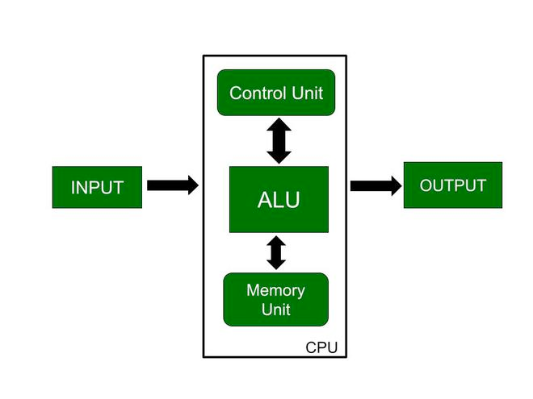
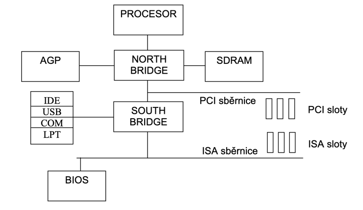

# 1 - Počítač a jeho stavba
**Počítač je elektronické zařízení, které je schopné provádět různé typy výpočtů a 
manipulací s daty podle instrukcí zadaných uživatelem nebo předem naprogramovaných 
algoritmů**. Moderní počítače jsou obvykle tvořeny několika základními komponenty, 
které spolupracují k dosažení požadovaného výkonu. 

Mezi tyto komponenty patří:

## **1. Procesor (CPU)**: 
Laicky ho můžeme nazvat "mozkem" počítače.
**Procesor je vhodný pro zpracování nespecifických úloh, je vhodný pro celou řadu typů výpočtů (narozdíl na příklad od
GPU, která také provádí výpočty, ale zdaleka není tak univerzální)**. **Moderní procesory jsou často vybaveny více jádry**,
což jim umožňuje provádět více úloh současně.

### 1.1 Architektura: 

Existují dvě základní koncepce konstrukce:

**John von Neumannova** je typická tím, že využívá jednu sběrnici, která je sdílená pro instrukce a data.
**Harvardská** architektura naopak využívá dvě samostatné sběrnice pro instrukce a data a umožňuje tak paralelní zpracování. Z toho důvodu je tato architektura využívaná.

Procesor můžeme rozdělit na 3 základní funkční jednotky:

1) **ALU (Arithmetic Logic Unit)** - provádí aritmetické a logické operace.
2) **Řadič instrukcí** - zajišťuje načítání instrukcí z paměti a jejich vykonávání.
3) **Paměťová jednotka** - ukládá data a instrukce, se kterými procesor pracuje.

Existuje několik různých architektur procesorů používaných v dnešních počítačíchß, 
z nichž každá má své vlastní charakteristiky a využití. 
**Mezi nejběžnější architektury procesorů patří**:

#### 1.1.1 x86: 
**Architektura x86 je nejběžnější architekturou procesorů v osobních počítačích a serverech**.
Tuto architekturu používají procesory vyrobené společnostmi jako Intel a AMD. 
**Instrukční sada x86 je velmi rozsáhlá a obsahuje mnoho různých instrukcí pro 
manipulaci s daty**, řízení toku programu a práci s pamětí.

#### 1.1.2 x86-64 (AMD64/Intel 64): 
Tato architektura je **rozšířením původní architektury x86 o 64bitový režim**. 
To umožňuje procesorům **pracovat s většími datovými bloky a pamětí**, což zvyšuje 
jejich výkon a možnosti. Většina moderních osobních počítačů a serverů používá 
architekturu x86-64.

#### 1.1.3 ARM: 
**Architektura ARM je široce používána v mobilních zařízeních**, vestavěných systémech, 
IoT (Internet of Things) zařízeních a dalších zařízeních s omezenými energetickými nároky.
**Procesory založené na architektuře ARM jsou často výkonné a energeticky úsporné**, 
což je dělá ideální volbou pro mobilní zařízení.

#### 1.2 Jádra (Cores): 
**Moderní procesory mohou mít jeden nebo více fyzických a/nebo virtuálních jader**. 
**Každé jádro může provádět vlastní instrukce nezávisle na ostatních jádrech**. 
Vícejádrové procesory umožňují paralelní zpracování úloh a zvyšují celkový výkon systému.

#### 1.3 Frekvence: 
**Frekvence procesoru udává, jak rychle může procesor provádět instrukce**. 
Vyšší frekvence znamená rychlejší výkon, ale také může znamenat vyšší spotřebu 
energie a produkci tepla.

#### 1.4 Cache paměť: 
**Procesor obsahuje různé úrovně cache paměti** (zpravidla L1 až L3), 
které slouží k ukládání často používaných dat a instrukcí, 
aby byly rychleji dostupné pro procesor. **Čím větší a rychlejší je cache paměť, 
tím lépe může procesor optimalizovat přístup k datům.**

Velikost L1 bývá maximálně stovky kilobajtů až jednotky megabytů,
L2 bývá v řádech jednotek megabytů a L3 v řádech desítek megabytů (u high end procesorů i stovky MB).

## 2. Chladič procesoru: 
Chladič procesoru je důležitou součástí počítače, 
která pomáhá udržovat teplotu procesoru na bezpečné úrovni.

Běžně se používají 2 základní typy chladičů:

- Vzduchový chladič, který využívá kovový heatsink a ventilátor k odvádění tepla z procesoru.
- Kapalinový chladič, který využívá kapalinu k odvádění tepla z procesoru do chladiče a následně funguje podobně jako vzduchový chladič.

## **3. Paměť (RAM)**: 
**Slouží k dočasnému ukládání dat a instrukcí**, 
se kterými procesor pracuje. Čím více paměti má počítač, 
tím větší množství dat může zpracovávat najednou, což může zlepšit jeho výkon.
**Je to taková krátkodobá paměť, která se vyprázdní po vypnutí počítače**.

Paměti podle generací dělíme na DDR1, DDR2, DDR3, DDR4 a DDR5. DDR5 je aktuálně nejnovější, ale
v provozu jsou běžně stále DDR3 a DDR4. Pozor, nejsou vzájemně kompatibilní, záleží na chipsetu základní desky a 
využitém procesoru.

Pro osobní počítače se používají paměti typu DIMM (Dual In-line Memory Module),
které se připojují do slotů na základní desce. Pro notebooky a jiná zařízení se používají paměti typu SO-DIMM (Small Outline DIMM).

Co se kapacity týče, do osobních počítačů se osazuje obvykle 8-32 GB paměti, servery dnes ale mívají klidně i přes 1 TB paměti.
Konkrétní zapojení pamětí na desce hraje roli, obvykle se totiž vyžívá vícekanálové připojení, které zvyšuje propustnost paměti.

## **4. Uložiště**: 
**Slouží k dlouhodobému ukládání dat**, 
včetně operačního systému, aplikací a uživatelských souborů. 
Pevné disky mají větší kapacitu a jsou levnější, zatímco SSD (Solid State Drive) 
nabízí rychlejší přístup k datům.

Typy úložišť:

### 4.1 Pevný disk (HDD):
**Pevné disky jsou tradiční formou úložiště, která využívá magnetické disky k ukládání dat**.

Technologie ukládání dat na plotnové disky:

- **SMR (Shingled Magnetic Recording)**: záznam dat na disku je uspořádán do překrývajících se "střech" (shingles), což umožňuje zvýšit hustotu dat a kapacitu disku.
- **PMR (Perpendicular Magnetic Recording)**: tradiční metoda ukládání dat, kdy jsou data zaznamenána kolmo k povrchu disku.
- **CMR (Conventional Magnetic Recording)**: obecný termín pro metody ukládání dat, které nejsou SMR.

### 4.2 SSD (Solid State Drive):
**SSD jsou moderní formou úložiště, která využívá flash paměť k ukládání dat**.
Můžeme je rozdělit na typy podle velikosti, kdy se nejčastěji používají 2,5" disky, M.2 disky disky.

Základní rozdíl je pak u SSD vidět mezi těmi, které využívají SATA rozhraní a NVMe disky, které využívají PCIe rozhraní.
NVMe jsou výrazně rychlejší, ale také dražší.

## **5. Grafická karta (GPU)**: 
**Je zodpovědná za zpracování grafických operací, 
jako jsou hry, videa nebo 3D modelování. Moderní grafické karty 
mají vlastní paměť a jsou schopny výrazně zvýšit grafický výkon počítače.**
Grafická karta má sloty na připojení monitoru a dalších zařízení pro zobrazení grafiky.

## **6. Základní deska (Motherboard)**: 
Základní deska je komponenta, která spojuje všechny další komponenty počítače a umožňuje jim vzájemně komunikovat.

Obvykle obsahuje:
- patici pro procesor
- paměťové sloty
- PCIe sloty pro grafickou kartu a další rozšiřující karty
- řízení napájení
- konektory pro připojení periferií
- integrované čipy pro zvuk, síťové připojení a další funkce
- ROM s firmwarem (BIOS nebo UEFI)
- Chipset, který řídí komunikaci mezi jednotlivými komponentami

U chipsetu by se dalo zmínit, že se dělí na severní a jižní můstek. Severní můstek je zodpovědný za komunikaci s procesorem, pamětí a grafickou kartou (komponenty vyžadující rychlejší odezvu), zatímco jižní můstek řídí komunikaci s periferiemi, jako jsou pevné disky, USB porty a síťové připojení.

Základní desky mají několik standardizovaných velikostí a formátů, které určují,
jaké komponenty lze na desku nainstalovat. Nejběžnější formáty základních desek jsou ATX, Micro-ATX a Mini-ITX.

## **7. Zdroj napájení (Power Supply Unit - PSU)**: 
**Poskytuje elektrickou energii pro všechny komponenty počítače. 
Jeho výkon musí být dostatečný pro napájení všech komponent, které jsou v 
počítači instalovány.**

Zdroje napájení opět můžeme různě dělit podle jejich vlastností:
- **Bronze, Silver, Gold, Platinum, Titanium**: stupně certifikace pro energetickou účinnost
- **Modulární zdroje**: umožňují odpojit nepoužívané kabely pro lepší vzhled a chlazení
- **Zdroje s jedním nebo více 12V větvemi**: důležité pro napájení grafických karet

## **8. Skříň (Case)**:
**Skříň počítače slouží k ochraně a chlazení všech komponent**.
Moderní skříně mají různé velikosti a designy, které umožňují snadnou instalaci

## Stavba počítače:
#### 1. Začněte s instalací procesoru na základní desku.
#### 2. Aplikujte teplovodivá pastu na CPu a připojte chladič procesoru k procesoru.
#### 3. Nainstalujte paměťové moduly do slotů paměti na základní desce.
#### 4. Nainstalujte desku do skříně.
#### 5. Nainstalujte PSU do skříně a připojte ho k základní desce.
#### 6. Nainstalujte uložiště (HDD, SSD) do skříně.
#### 7. Nainstalujte grafickou kartu do slotu PCIe na základní desce.
#### 8. Připojte všechny kabely a kabely k základní desce a ostatním komponentám.
#### 9. Nainstalujte chladiče a ventilátory do skříně pro lepší chlazení.
#### 10. Zkontrolujte, zda jsou všechny komponenty správně připojeny a zda jsou všechny kabely správně připojeny.
#### 11. Zapněte PSU poté počítač a nainstalujte operační systém.
#### 12. Nakonec nainstalujte ovladače a aktualizace pro všechny komponenty.