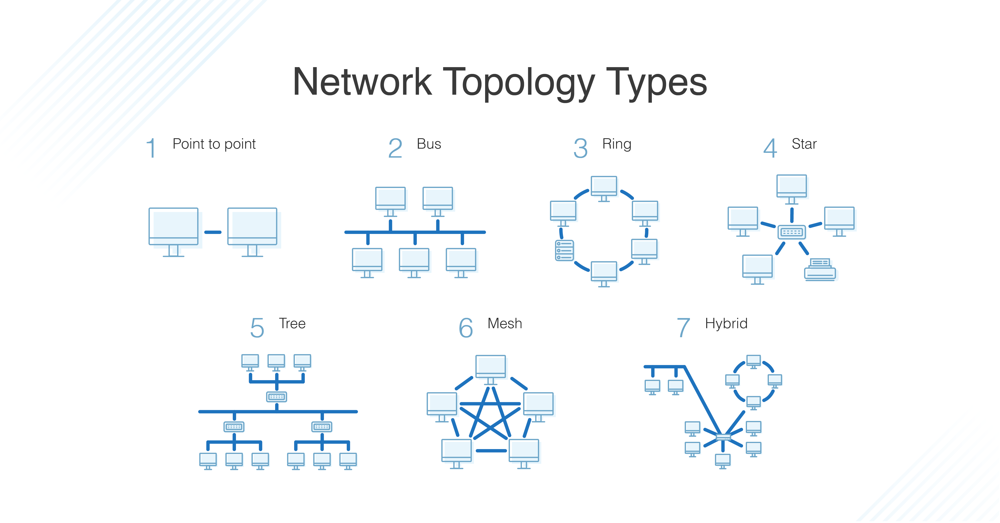
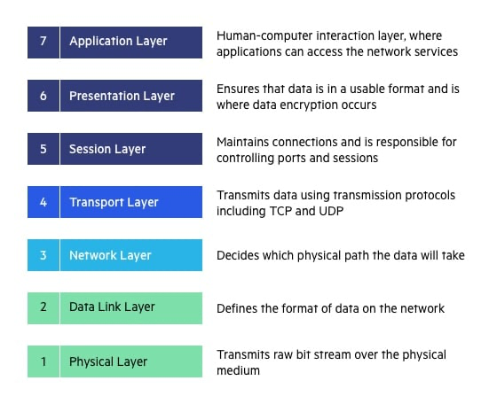
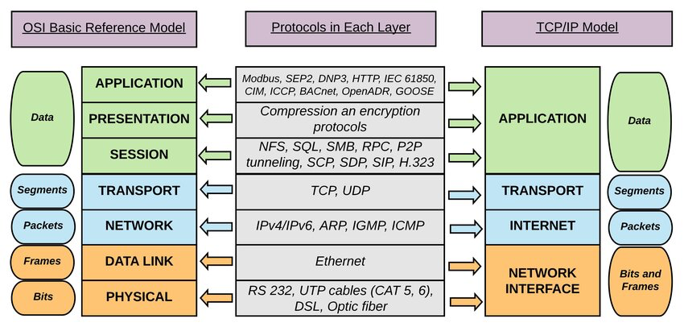

# 05 - Počítačové sítě, hierarchie, topologie, komunikace v síti – referenční modely a standardy

## Základní pojmy
  •	Symetrický vs asymetrický přenos dat: Při symetrickém přenosu dat je stejná rychlost upload/download, naopak při asymetrickém se liší.
  •	Redundance: Nadbytečnost (označení situace, kdy je použito více prvků, než je nutné).
  •	P2P (Peer-to-Peer): Označení typu počítačových sítí, kde komunikují spolu přímo, rovnocenně jednotliví klienti.
  •	Topologie sítí: Zabývá se zapojením různých prvků do počítačové sítě, zachycením jejich skutečné a logické podoby. Fyzická topologie zahrnuje rozdělení prvků do místností, zatímco logická topologie zahrnuje rozdělení prvků do sítí, do VLAN atd.
  •	ISP (Internet Service Provider): Poskytovatel připojení k internetu a služeb s tím spojených.
  •	Server: Označení pro počítač, který poskytuje služby.

## Klient:  
•	Označení pro počítač, který využívá služby.
  •	Tlustý klient (Obsáhlý klient): Provádí všechny operace sám, nemusí spoléhat na server. Nejčastěji v podobě osobního počítače, laptopu.
  •	Tenký klient: Využívá zdrojů hlavně z hostitelského počítače, víceméně jen zobrazuje grafická data poskytované aplikačním serverem. Výhodou je ovladatelnost a pružnost.
  •	Hybridní klient: Směs modelů klienta. Sám zpracovává operace, ale spoléhá i na server.

## Služba: 
Realizuje spojení a výměnu informací mezi počítači, komunikuje podle určitých pravidel, za účelem sdílení společných zdrojů nebo výměny zpráv.
## Agregace: 
Spojování, seskupování, shlukování (udává se x: y–x → minimální podíl; y → maximální podíl z rychlosti).
## Bezstavovost: 
Vztahuje se k implementaci protokolů, kde protokol je jednoduché implementovat a představuje malou zátěž pro server. Jednotlivé požadavky na server položené spolu nejsou nijak svázány, server neví, zda jsou od téhož uživatele, zda spolu nějak souvisejí.
## Síťová karta: 
Hardware k vzájemné komunikaci v PC síti.
## Firewall: 
Kontrola a omezení komunikace počítače po síti.

## Počítačové sítě: 
Souhrnné označení pro technické prostředky (např. PC, switch, router, kabely), které realizují spojení a výměnu informací mezi počítači, umožňující komunikaci podle určitých pravidel – sdílení prostředků, výpočetního výkonu, výměny zpráv.
### Součásti sítě:
 •	Síťové uzly: Každý uzel musí mít svoji MAC adresu nebo adresu řízení datového spoje (např. IP).
  •	Výkonná zařízení (servery, stanice):
  •	Propojovací zařízení (aktivní, pasivní):
## Síťová propojení:
 •	Drátově (fyzicky):
  •	Metalický kabel
  •	Optický kabel
  •	Bezdrátově:
  •	Rádiové vlny
  •	Satelitní/optický přenos

## Síťové služby (příklady):
 •	Webové
  •	Poštovní
  •	Tiskové
  •	Souborové
  •	Pro vzdálenou práci s počítačem
  •	Servisní

## Síťový software:

  •	Prohlížeče internetových stránek
  •	Poštovní programy
  •	Chat
  •	Torrent klienty
  •	Firewall
  •	Vzdálená plocha
## Zabezpečení sítě:
  •	Skrytí SSID
  •	Firewall
  •	Filtrování MAC adres
  •	Statické IP adresy
  •	Šifrování komunikace pomocí min. WPA2 nebo WPA3
  •	Rozdělení sítě na VLANy

## Sledované vlastnosti sítě:

  •	Způsob přenosu signálu
  •	Bezpečnost
  •	Instalační požadavky
  •	Šířka pásma
  •	Útlum
  •	Vzájemné ovlivňování a rušení (EMI)
  •	Aktivní síťové prvky:
  •	Cena

## Typy vzájemných vztahů stanic v síti:
### Client-Server: 
Odděluje klienta a server, které komunikují přes počítačovou síť. Při vyšším počtu klientů klesá průměrná přenosová rychlost. Nejčastějšími klienty jsou dnes webové prohlížeče (Chrome, Brave, Firefox). Klient (aktivní, posílá žádosti serveru, čeká a dostává odpovědi) X server (pasivní, naslouchá síti/reaguje na žádosti, při přijetí požadavku jej obslouží).
### P2P: 
Například sdílení složek v místnosti se vzájemně propojenými počítači. Patří sem také technologie jako Torrent a blockchain. Při vyšším počtu stanic roste přenosová kapacita.
 
### Hierarchický model sítě: 
Propojení zařízení v menší nebo střední firmě. Zajišťuje přehledný chod sítě, rychlejší opravy a snadnější správu. Dovoluje efektivně přidělovat adresy a lehce je sumarizovat, což zpřehledňuje toky dat. Spočívá v rozdělení sítě na samostatné vrstvy.
### Přístupová vrstva: 
Obsahuje koncová zařízení (PC, tiskárny, IP telefony) a poskytuje přístup do zbytku sítě. Hlavním účelem je připojit koncová zařízení k síti a kontrolovat, která zařízení mají povoleno v síti komunikovat.
### Distribuční vrstva: 
Agreguje datový provoz a kontroluje síťový provoz lokální sítě. Zahrnuje obvykle velmi výkonná zařízení s vysokou dostupností a redundancí k zaručení bezporuchovosti.
### Jádro: 
Představuje vysokorychlostní páteř sítě, která musí být velmi spolehlivá a připojena k internetu často více linkami pro rychlý přenos velkého objemu dat.

## Základní topologie sítě:

- Logické topologie - **Token Ring** (bezkolizní, typicky průmysl) a Anarchie (**Ethernet**) (bez detekce kolizí). 

### Sběrnicová topologie (BUS): 
Nejjednodušší způsob zapojení počítačů do sítě, kde se všechny stanice propojují jediným kabelem (hlavní kabel/segment/páteř), který spojuje všechny PC.
### Kruhová topologie (RING): 
Počítače jsou propojeny kabelem do jediného okruhu, kde neexistují zakončené konce. Signál putuje po smyčce v jednom směru a prochází všemi PC.
### Hvězdicová topologie (STAR):
Každý počítač je připojený pomocí kabelu k centrálnímu prvku. Mezi dvěma stanicemi existuje vždy jen jedna cesta.
### Stromová topologie (TREE): 
Vychází z hvězdicové topologie spojením aktivních síťových prvků do stromové struktury.
### Smíšená topologie: 
Spojuje více topologií do jednoho funkčního celku, například kombinaci TREE a STAR.
 
## Logické topologie sítě:
  •	Token Ring: Používá token, kterým se řídí přenos dat. Kdo má token, může komunikovat, a když token nepotřebuje, posílá ho dál. V síti musí být řídící prvek, který může být označován jako "klasická máma".
  •	Ethernet: Dva prvky sítě komunikují spolu, ale pokud dojde k chybě (například rušení jiným prvkem), je komunikace na dobu přerušena, dokud se neuvolní pásmo. Inspirace pro názvy pochází z literárních postav jako Vinnetou, Old Shatterhand a ukecaná Ribana.
## Síťové modely:
Souhrn pravidel a úmluv standardizujících prvky sítě, jako jsou:
  •	Standardy pro podobu a tvorbu kabelů a konektorů.
  •	Standardy pro stanovení napěťové úrovně logické 0 a logické 1.
  •	Protokoly pro opravu chyb, zasílání požadavků a příjem souborů ze serveru, přenos dat mezi klientem a serverem a pro internetové telefony. Příkladem jsou například modely ISO/OSI (spíše teoretický) a TCP/IP (praktický).
 

## ISO/OSI (standard) a TCP/IP model

 

**Fyzická vrstva** - jedničky, nuly (v podobě napětí). 4A/4B kódování = 4 bity se převedou na 5 bitů (tak aby vždy byla aspoň 1 změna), aby se zvýšila odolnost proti chybám. Ethernet - 8 drátů, 4 dvojice. 100mbit využívá 2 páry, gigabit všechny 4. (více viz otázka 6).

**Datová vrstva** - LLC, MAC. Pracujeme s rámci Rámce mají hlavičku a patičku. Hlavička obsahuje MAC adresu odesílatele a příjemce, typ rámce. Patička obsahuje kontrolní součet. MAC adresy se "přebalují" v rámci lokálních sítí. MAC má 48-bitů, zapisuje se v hex, má část výrobce + náhodný kód. LLC - vytváří rámec, vkládá parametry headeru. ARP protokol používá tuto vrstvu.

**Síťová vrstva** - Packety, adresace. IPv4, IPv6, ICMP. IP adresy - 32 bitů, rozděleny na 4 oktety. IPv4 - 4 miliardy adres, IPv6 (128 bitů) - 340 sextilionů. ICMP - protokol pro diagnostiku sítě, např. ping, traceroute. Maska sítě - určuje velikost pro síť a pro hosta. Třída A - maska /8, třída B - /16, třída C - /24. IPv6 lokální maska fe80, generuje se automaticky. Nedostupný vs neznámý u pingu - nedostupný = router neví, kam poslat, neznámý = cílový uzel neodpovídá.  Traceroute - sleduje cestu paketu, TTL se snižuje o 1, pokud dojde na 0, paket se zahodí a pošle se zpráva zpět. Ping - ICMP echo request, echo reply.

**Transportní vrstva** TCP/UDP. UDP - nespolehlivý, bezspojový, např. DNS. TCP - three-way-handshake, spolehlivý, spojový, např. HTTP. Transportní vrstva také řeší čísla portů. 3 skupiny portů: well-known (0-1023), registered (1024-49151), dynamic (49152-65535).

**Relační vrstva** - zajišťuje a udržuje spojení mezi aplikacemi.

**Prezentační vrstva** - kóduje data.

**Aplikační vrstva** - samotné služby s vlastními protokoly. DHCPv6: 3 typy: SLAAC (automatické přidělení, SLAAC pouze dodává default gateway), SLAAC+DHCPv6 (dává navíc DNS), stateful (klasické DHCP). DHCPv4: kroky - discovery (broadcast), offer (unicast), request (broadcast), ack (unicast). DNS - překlad doménových jmen na IP adresy. Stromová struktura DNS.

----

dále: 
Trojvrstvá architektura v datacentrech.
