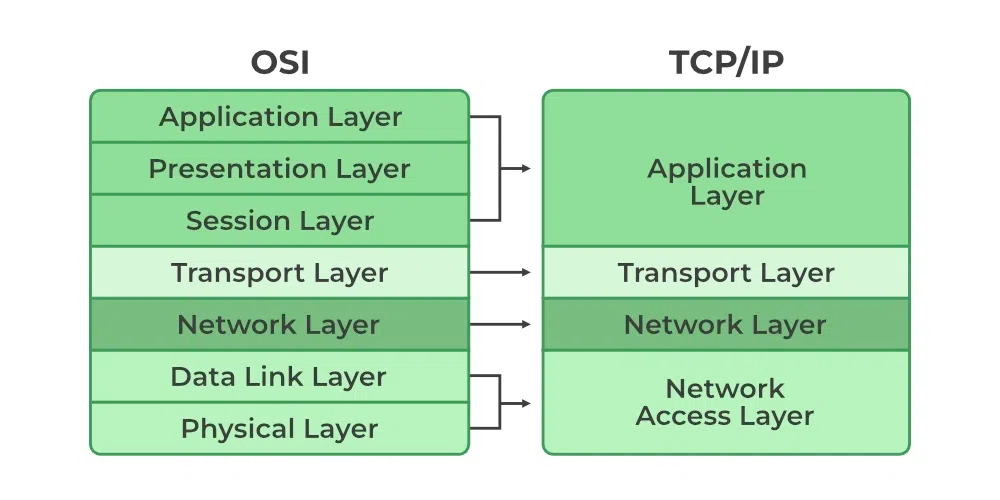
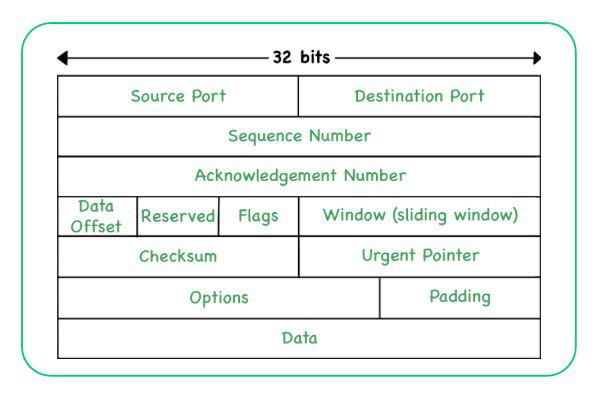

# 7 - TCP/IP, síťové služby a jejich konfigurace

# TCP/IP Protokol
TCP/IP (Transmission Control Protocol / Internet Protocol) je standardizovaný protoklol používaný prakticky v celém
Internetu. Prosadil se díky své implementaci v rámci UNIXu v 80. letech. Nahrazoval zastaralý NCP, který byl používaný v
rámci ARPANETu.

**TCP** zajišťuje transportní část. Jeho hlavním úklolem je převádět libovolné zprávy na seklvenci packetů na zdrojovém
uzlu a jejich následné sestavení zpět na cílovém uzlu.

**IP** protokol zajišťuje ověření krektnosti zpráv a obhospodařuje adresování. Cílem je kompatibilita směřování i mezi sítěmi
postavených například právě na ARPANETu, Ethernetu, FDDI apod. Zajišťuje, aby data "tekla" co nejoptimálnější cestou mezi uzly sítě.

TCP/IP vychází z podstaty dělení vrstev od návrhářů modelu OSI. TCP/IP jako takový je rozdělen do 4 vrstev:

> **Tady je důležité si uvědomit rozdíl mezi OSI a TCP/IP!** OSI je teoretický ideální model, avšak internet reálně využívá jeho "simplifikovanou"
> verzi - TCP/IP. TCP/IP model je "pouze" 4-vrstvý, zatímco OSI je 7-vrstvý, protože slučuje některé vrstvy do jedné a OSI model je pro něj pouze "inspirace".
> 

1) **Aplikační vrstva** - zajišťuje komunikaci mezi aplikacemi. Zde se nachází protokoly jako HTTP, FTP, SMTP, POP3, IMAP, DNS, DHCP, SNMP, Telnet, SSH, SSL/TLS, ...
Na rozdíl od RM OSI neobsahuje podpůrné vrstvy pro komprimaci, šifrování a podobně.
2) **Transportní vrstva** - zajišťuje spolehlivý přenos dat mezi koncovými body. Zde se nachází protokoly jako TCP, UDP, ...
3) **Síťová vrstva** - zajišťuje směrování dat mezi různými sítěmi. Zde se nachází protokol IP, úzce spojený s ICMP, ARP, ...
4) **Linková vrstva** - zajišťuje přenos dat mezi sousedními uzly. Zde se nachází protokoly jako Ethernet, Wi-Fi - tedy netýká se vlastně ani tak přímo TCP/IP protokolu.

U TCP/IP se také ještě hodí poznamenat, že neřeší zabezpečení přenosu dat. Je navržený tak, aby byl co nejvíce efektivní,
bezpečnost je tedy otázkou implementace nadstavby na aplikační vrstvě, jako je například SSL/TLS.

### Formát TCP/IP packetu

Každý TCP/IP packet se skládá z hlavičky a těla. Hlavička obsahuje informace o zdroji, cíli, velikosti packetu, kontrolní
součet a další. Tělo obsahuje samotná data.

## Transportní vrstva - TCP/UDP

### TCP
TCP (Transmission Control Protocol) je spojově orientovaný protokol, který zajišťuje spolehlivý přenos dat mezi dvěma uzly.
Jeho klíčovou vlastností je, že před každou výměnou dat musí být nejprve navázáno spojení, které je po ukončení přenosu
opět zrušeno. TCP zajišťuje, že data dorazí v pořádku, v pořadí a bez chyb. Pokud dojde k chybě, je odesílatel vyzván k
opětovnému odeslání dat.

TCP je založen na principu třícestného handshaku. Probíhá následovně:
1) **SYN** - klient pošle serveru zprávu s nastaveným SYN bitem
2) **SYN-ACK** - server odpoví klientovi zprávou s nastaveným SYN a ACK bitem
3) **ACK** - klient odpoví serveru zprávou s nastaveným ACK bitem
4) **Přenos dat** - následuje samotný přenos dat
5) **FIN** - klient pošle serveru zprávu s nastaveným FIN bitem
6) **FIN-ACK** - server odpoví klientovi zprávou s nastaveným FIN a ACK bitem
7) **ACK** - klient odpoví serveru zprávou s nastaveným ACK bitem
8) **Ukončení spojení** - spojení je ukončeno

Využívá se všude, kde je potřeba přenos dat bez ztrát, například pro HTTP, HTTPS, FTP, SMTP, POP3, IMAP, ...

### UDP
UDP (User Datagram Protocol) je protokol, který je na rozdíl od TCP nespojově orientovaný. To znamená, že nevyžaduje
navázání spojení před samotným přenosem dat. Data prostě "nablije do sítě" a o víc se nestará, zda dorazí, v jakém pořadí
nebo zda dorazí vůbec. UDP je díky tomu výrazně rychlejší, ale za cenu nejisté spolehlivosti. Používá se například pro
streamování videa, VoIP, ..., kde nám nevadí, když nám například 1 snímek ze 60 za vteřinu nepřijde.

## Síťová vrstva - IP

### IPv4

IPv4 bychom a this point měli všichni znát... 32-bitová adresa, která se skládá ze 4 oktetů oddělených tečkou. Každý oktet
může nabývat hodnoty 0-255. Celkem tedy máme 2^32 možných adres, což je cca 4 miliardy. To je ale málo, protože
adresy se rychle vyčerpávají, in fact už dávno došly a IPv4 rozsahy se draží za těžké peníze. Proto byl vytvořen IPv6. Čátečně
se to řeší i NATem, který umožňuje překládat veřejné a privátní adresy.

Více k IPv4: https://github.com/Kesims/ps4-resources/blob/main/network_addressing/IPv4%20Cheatsheet.md 

### IPv6
Modernější varianta adresování, která využívá 128-bitové adresy. To je 2^128 možných adres... prostě aspoň na chvíli
nebudeme mít problém s nedostatkem adres.

Více k IPv6: https://github.com/onemarcfifty/cheat-sheets/blob/main/networking/ipv6.md

## Aplikační protokoly, jejich služby a konfigurace

### HTTP
Protokol pro komunikaci mezi WWW servery a jejich klienty. Umožnuje browseru si vyžádat určitou stránku a server mu ji poslat.
HTTP je bezestavový protokol, což znamená, že každý požadavek je nezávislý na předchozím.

HTTP využívá několik metod:
- **GET** - získání dat
- **POST** - odeslání dat
- **PUT** - aktualizace dat
- **DELETE** - smazání dat
- a pár dalších co nikdo nepoužívá...

Na HTTP navazuje HTTPS, což je zabezpečená verze HTTP, která využívá SSL/TLS pro šifrování dat.
V případě HTTPS jsou zprávy podepisovány certifikátem, který je vydán certifikační autoritou. Tyto
certifikáty mohou být placené (např. od Symantecu) i zdarma (např. Let's Encrypt).

Standardizované porty jsou 80 pro HTTP a 443 pro HTTPS.

### FTP
Protokol pro přenos souborů mezi počítači. FTP je spojově orientovaný protokol, který vyžaduje přihlášení uživatele
před tím, než mu umožní přístup k souborům. FTP obvykle využívá 2 porty - 21 pro řízení a 20 pro přenos dat.

Například na Linuxu se jako FTP server často využívá vsftpd. Jeho konfigurace se nachází v souboru `/etc/vsftpd.conf`.
Některé důležité parametry:
- **anonymous_enable** - zda je povoleno anonymní přihlašování
- **local_enable** - zda je povoleno lokální přihlašování
- **write_enable** - zda je povoleno zapisování
- **chroot_local_user** - zda je uživatel "uvězněn" ve svém domovském adresáři
- **local_root** - cesta k domovskému adresáři
- **anon_root** - cesta k domovskému adresáři pro anonymní uživatele
- **listen** - na jakém portu bude FTP server naslouchat
- **a další...**

Opět existuje zabezpečená verze - FTPS, která využívá SSL/TLS.

### SMTP
Protokol pro odeslání emailů. SMTP je spojově orientovaný protokol, který zajišťuje doručení emailu na server, kde je
příjemce schopen si ho stáhnout. Standardizovaný port je 25.

### POP3
Protokol pro stahování emailů z emailového serveru. POP3 je spojově orientovaný protokol, který umožňuje klientovi
stáhnout emaily ze serveru. Standardizovaný port je 110.

### IMAP
Protokol pro stahování emailů z emailového serveru. IMAP je spojově orientovaný protokol, který umožňuje klientovi
stáhnout emaily ze serveru. Na rozdíl od POP3 ale neukládá emaily na klienta, ale pracuje s nimi přímo na serveru.

Mailová služba je poměrně komplexní, zajišťuje doručení emailů. V rámci konfigurace mailového serveru řešíme několik
parametrů:
- **Domény** - které domény server obsluhuje
- **Uživatelé** - kteří uživatelé mohou posílat a přijímat emaily
- **Forwarding** - předávání emailů na jiný email
- **Antispam** - ochrana proti spamu
- **Antivirus** - ochrana proti virům
- **IMAP/POP3** - konfigurace pro stahování emailů
- **SMTP** - konfigurace pro odesílání emailů
- **Webmail** - konfigurace pro přístup k emailům přes web
- **Zabezpečení** - zabezpečení emailového serveru, podepisování certifikátem, ...
- **a další...**

### DNS
Protokol pro překlad doménových jmen na IP adresy. DNS je bezestavový protokol, který umožňuje klientovi získat IP adresu
pro doménové jméno. Standardizovaný port je 53. Využívá UDP.

V případě DNS je důležité si uvědomit, že DNS je hierarchický systém. Pokud se klient pokusí získat IP adresu pro doménu,
kterou jeho DNS server nezná, pošle dotaz na vyšší DNS server, a tak dále, až se dostane až k root DNS serverům.

DNS záznamy jednotlivých domén mohou být různého typu:
- **A** - záznam pro IPv4 adresu
- **AAAA** - záznam pro IPv6 adresu
- **CNAME** - alias pro jiný záznam
- **MX** - záznam pro emailový server
- **TXT** - záznam pro textové informace
- **PTR** - záznam pro reverzní překlad IP adresy na doménové jméno
- a další...

V rámci konfigurace DNS služby řešíme několik parametrů:
- **Zóny** - oblasti, které DNS server spravuje
- **Záznamy** - jednotlivé záznamy v rámci zón
- **Forwarding** - předávání dotazů na jiný DNS server
- **Rekurze** - zda DNS server umožňuje rekurzivní dotazy
- **Zónové soubory** - soubory, ve kterých jsou uloženy záznamy
- **Logging** - logování dotazů
- **ACL** - přístupová práva
- **DNSSEC** - zabezpečení DNS
- **TSIG** - zabezpečení zónových souborů
- **a další...**

### DHCP
Protokol pro automatické přidělování IP adres. DHCP je spojově orientovaný protokol, který umožňuje klientovi získat
IP adresu, masku sítě, bránu a další informace. Standardizovaný port je 67 a 68.

V rámci konfigurace DHCP řešíme několik parametrů:
- **Rozsah IP adres** - jaké IP adresy může DHCP server přidělovat, označované jako "pool"
- **Výchozí brána** - IP adresa brány, která bude spolu s IP adresou zaslána, slouží jako výchozí cesta ven z lokální sítě
- **DNS servery** - IP adresy DNS serverů, které budou zaslány klientovi
- **Doba platnosti** - jak dlouho bude přidělená IP adresa platná
- **Další informace** - například doménové jméno, ...

### SNMP
Protokol pro monitorování síťových zařízení. SNMP je bezestavový protokol, který umožňuje klientovi získat informace
o síťovém zařízení. Standardizovaný port je 161 a 162.

### Telnet
Protokol pro vzdálený přístup k počítači. Telnet je spojově orientovaný protokol, který umožňuje klientovi připojit se
k vzdálenému počítači a pracovat s ním. Standardizovaný port je 23. Nešifrovaný, už se kvůli tomu tolik nepoužívá.

### SSH
Nástupce Telnetu. SSH je spojově orientovaný protokol, který umožňuje klientovi připojit se k vzdálenému počítači a pracovat
s ním. Na rozdíl od Telnetu je ale šifrovaný. Standardizovaný port je 22.

SSH server je například nainstalován na většině linuxových distribucí. Jeho konfigurace se nachází v souboru `/etc/ssh/sshd_config`.
Některé důležité parametry:
- **Port** - na jakém portu bude SSH server naslouchat
- **PermitRootLogin** - zda je povoleno přihlašování jako root
- **PasswordAuthentication** - zda je povoleno přihlašování heslem
- **PubkeyAuthentication** - zda je povoleno přihlašování klíčem
- **AllowUsers** - kteří uživatelé mohou přistupovat
- **DenyUsers** - kteří uživatelé nemohou přistupovat
- **AllowGroups** - které skupiny mohou přistupovat
- **DenyGroups** - které skupiny nemohou přistupovat
- **Banner** - cesta k souboru s upozorněním před přihlášením
- **HostKey** - cesta k souboru s klíčem
- **a další...**

### SCP
Zabezpečená alternativa k FTP. Under the hood využívá SSH a tedy strandardizvaný port je také 22.

