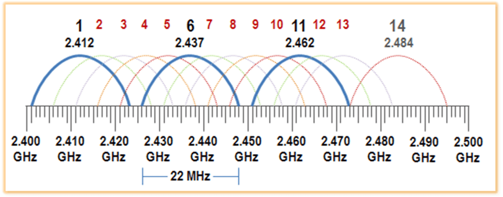
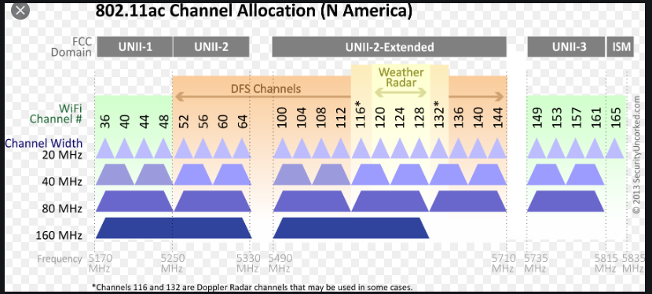
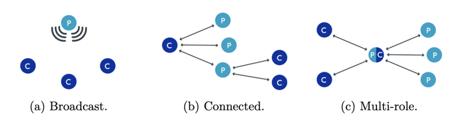
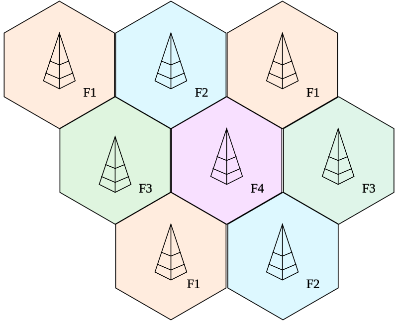

# Bezdrátové technologie

Vývoj bezdrátových sítí byl podobný jako u sítí kabelových. Začínalo se jednoduchými technologiemi bez standardizace,
později hlavní výrobci založili WECA (Wireless Ethernet Compatibility Alliance) a vytvořili první standardy zajištění
kompatibility mezi zařízeními.

## Fyzika za bezdrátovými technologiemi

Bezdrátové technologie využívají elektromagnetické záření k přenosu informací mezi zařízeními.
Toto záření se šíří ve formě vln, které mají různé vlastnosti, jako je frekvence, vlnová délka a amplituda.

### Modulace (samotný přenos informace pomocí nosné vlny)
Modulaci můžeme dělit na dva základní typy:

- **Analogová modulace** - amplitudová, frekvenční ôa fázová modulace. Používá se pro přenos analogových signálů, jako jsou hlasové hovory nebo zvukové signály.
- **Digitální modulace** - amplitudová posuvná modulace (ASK), frekvenční posuvná modulace (FSK) a fázová posuvná modulace (PSK). Používá se pro přenos digitálních dat, jako jsou textové zprávy, obrázky nebo videa.

## Topologie bezdrátových sítí
Topologie sítě určuje, jak jsou zařízení propojena a jakým způsobem komunikují.

### Ad-hoc topologie
Ad-hoc topologie je bezdrátová síť, ve které jsou zařízení propojena přímo mezi sebou bez centrálního uzlu nebo směrovače 
(lze si ji představit jako peer-to-peer). Je vhodná pro sítě s nižším počtem zařízení. Výhodou je, je jednoduchost, avšak
může být problém například se zabezpečením.

Do této skupiny lze zahrnout Bluetooth, Wi-Fi Direct, Zigbee nebo například i NFC.

### Infrastrukturní topologie
Jedná se o bezdrátovou síť s centrálními prvky (přístupové body - AP). Zařízení se připojují k AP, které slouží jako
prostředník pro komunikaci mezi nimi. Tato topologie je vhodná pro větší sítě s vyšším počtem zařízení. Topologii si lze
představovat v podstatě jako klient-server model.

## Historie bezdrátových technologií
Pro představu vývoje je zde pár milníků:

- 1895 - Guglielmo Marconi vynalezl bezdrátový telegraf
- 1940 - první bezdrátové telefony
- 1970 - první mobilní telefon Motorola DynaTAC
- 1997 - vznik standardu Wi-Fi 802.11
- 2000 - vznik standardu Bluetooth
- 2009 - vznik standardu LTE
- 2019 - vznik standardu 5G

## Wi-Fi

Wi-Fi je technologie pro lokální bezdrátové sítě, založená na standardu IEEE 802.11. Je designovaná pro plnou kompatibilitu
s Ethernetem. Je pro ni typické využití na frekvencích 2,4 GHz (20 MHz a 40 MHz šířka pásma), 5 GHz (20, 40 a 80 MHz šířka
pásma) a 6 GHz (20, 40, 80, 160 MHz).

Vyhrazená pásma dělíme dále na kanály, které se mohou překrývat. Pokud chceme využít Wi-Fi co nejefektivněji, je vhodné
vybrat kanál, který je co nejméně využívaný, ideálně bez překrytí s jinými kanály.

V případě 2,4 GHz se typicky jedná o 13 kanálů.

V případě 5 GHz se jedná o 25 kanálů.

### Standardy Wi-Fi

| Generation | IEEE Standard | Adopted | Maximum Link Rate (Mbit/s) | Radio Frequency (GHz)  |
|------------|---------------|---------|----------------------------|------------------------|
| Wi-Fi 8    | 802.11bn      | 2028    | 100,000                    | 2.4, 5, 6, 7, 42.5, 71 |
| Wi-Fi 7    | 802.11be      | 2024    | 1376–46,120                | 2.4, 5, 6              |
| Wi-Fi 6E   | 802.11ax      | 2020    | 574–9608                   | 6                      |
| Wi-Fi 6    | -             | 2019    | -                          | 2.4, 5                 |
| Wi-Fi 5    | 802.11ac      | 2014    | 433–6933                   | 5                      |
| Wi-Fi 4    | 802.11n       | 2008    | 72–600                     | 2.4, 5                 |
| Wi-Fi 3*   | 802.11g       | 2003    | 6–54                       | 2.4                    |
| Wi-Fi 2*   | 802.11a       | 1999    | -                          | 5                      |
| Wi-Fi 1*   | 802.11b       | 1999    | 1–11                       | 2.4                    |
| Wi-Fi 0*   | 802.11        | 1997    | 1–2                        | 2.4                    |

\*Wi‑Fi 0, 1, 2, a 3 nemají oficiální definici, jsou takto pouze značeny pro účely historického přehledu.

Wi-Fi se ale nevyužívá pouze pro sítě řekněme v rámci 1 budovy, ale lze ji najít také například v několikakilometrových
point to point spojích.

### Konfigurace a zabezpečení sítě Wi-Fi

Každý access point má své **SSID**, pod kterým ho vidí okolní zařízení. Vysílání SSID je možné vypnout, klient se pak
musí při připojení sám na SSID dotázat.

Zabezpečení bylo kdysi řešeno pomocí WEP (Wired Equivalent Privacy), které bylo ale velmi snadné prolomit. To samé
později platilo pro WPA (Wi-Fi Protected Access). Dnes se používá WPA2 nebo WPA3, které jsou mnohem bezpečnější.

## Bluetooth

Bluetooth je bezdrátová technologie pro kratší vzdálenosti. Využívá frekvence 2,4 GHz a je vhodná pro propojení nositelných
zařízení, jako jsou sluchátka, chytré hodinky, nebo i klávesnice, myši apod.

Bluetooth však v posledních letech udělal poměrně velký pokrok, zařezení Bluetooth Low Energy (BLE) disponují velmi nízkou
spotřebou energie a jsou tak vhodné pro IoT zařízení. Nový standard navíc zavedl také 125 kbps a 1.4 Mbps rychlosti, přičemž
při nižsích rychlostech je tzv. "Long Range PHY" možné využívat k přenosu dat i na vyšší stovky metrů.

Topologie sítě BLE mohou být:
- **Broadcast** - zařízení nenavazují spojení, pouze okolo sebe "křičí data" - velikost dat je značně omezena
- **Connected** - zařízení navazují spojení, mohou si posílat větší množství dat
- **Multi-role** - zařízení může být současně v obou rolích

Zařízení v síti pak vystupují jako
- **Central** - zařízení, které iniciuje a řídí komunikaci
- **Peripheral** - zařízení, které odhaluje svou přítomnost a přijímá žádosti o spojení

Data tato zařízení vystavují pomocí tzv. **GATT** (Generic Attribute Profile), který definuje služby a charakteristiky, které
zařízení nabízí. Každá služba může mít několik charakteristik, které mohou být buď čtené, zapisovány, nebo mohou notifikovat
změny.

Službou by mohla být například **Heart Rate Service**, která by mohla obsahovat charakteristiku **Heart Rate Measurement**,
která by mohla notifikovat změny v hodnotě srdečního tepu, a dále charakteristiku **Body Sensor Location**, která by mohla
obsahovat informaci o tom, kde je senzor umístěn.

## Mobilní sítě

Mobilní sítě jsou základem moderního bezdrátového spojení. Klíčovým prvkem těchto sítí je jejich buňková struktura,
která umožňuje efektivní využití frekvenčního spektra a pokrytí rozsáhlých oblastí.

**Buňková síť** je rozdělena do geografických buněk, každá s vlastním vysílacím zařízením (bázová stanice).
Tento systém umožňuje efektivní využití frekvenčního spektra a snižuje interferenci.

### Generace mobilních sítí

- 2G (GSM): Zavedená v 90. letech, umožňovala hlavně hlasové hovory a SMS.
- 3G: Přinesla datové služby jako e-mail a internetový prohlížeč.
- 4G LTE: Poskytuje vysokorychlostní internet a podporuje aplikace jako streamování videa.
- 5G: Nová generace s ultra-vysokými rychlostmi, nízkou latencí a podporou velkého množství připojených zařízení.

Každá generace mobilní sítě využívá různé frekvence. Vyšší frekvence, jako je mmWave v 5G, umožňují vyšší rychlosti, ale mají menší dosah.

- GSM: 900 MHz, 1800 MHz
- 3G: 2100 MHz
- LTE: 700 MHz, 800 MHz, 1800 MHz, 2600 MHz
- 5G: 600 MHz, 3.5 GHz, mmWave (24 GHz a vyšší)

**Rychlosti a výkon**

- 2G: Desítky kbit/s
- 3G: Několik Mbit/s
- LTE: Desítky až stovky Mbit/s
- 5G: Potenciálně až několik Gbit/s

**Použití a aplikace**

- Hlasové hovory: Využívány všemi generacemi, přestože novější technologie podporují i VoLTE (Voice over LTE).
- Datové služby: Streamování videa, stahování aplikací, prohlížení webových stránek.
- Internet věcí (IoT): 5G umožňuje propojení obrovského množství zařízení s nízkou latencí a vysokou spolehlivostí.

**Pojmy - handlování klientů**

- Handover: Přenos spojení mezi buňkami při pohybu klienta, aby se udržela kvalita spojení.
- Quality of Service (QoS): Mechanismy pro zajištění kvality služeb, například prioritizace hlasových hovorů před datovým provozem.

### Další bezdrátové technologie

- **RFID (Radio Frequency Identification)**: Používá se pro identifikaci a sledování objektů... např. čip na otevření dveří u školy, čip do jídelny, městská karta apod. jsou postaveny RFID.
- **NFC (Near Field Communication)**: Poddruh RFID. Umožňuje bezdrátovou komunikaci na krátkou vzdálenost, často využívaná pro platební systémy a propojení elektronických zařízení.
- **Zigbee**: Bezdrátová technologie pro sítě typu mesh, často využívaná pro IoT a chytré domácnosti. Umožňuje teoreticky 
propojit stovky zařízení, avšak využívá tzv. "hub", který komunikaci v síti řídí. Kvůli tomuto centrálnímu prvku je reálný počet zařízení zpravidla maximálně ve vyšších desítkách.
- **LoRa a LoRaWAN**: Technologie pro dlouhé dosahy a nízkou spotřebu energie, často využívaná pro IoT a senzorové sítě. LoRa je fyzická vrstva, zatímco LoRaWAN je protokol
pro komunikaci mezi zařízeními a bránami. Tato technologie má velmi omezenou datovou propustnost, maximálně stovky bytů za sekundu. Je tak vhodná pro velmi malé objemy dat.
- **Z-Wave**: Další technologie pro chytré domácnosti, která využívá frekvenci 900 MHz. Z-Wave je uzavřený standard, což znamená, že všechna zařízení musí být certifikována a splňovat určité požadavky. To zajišťuje větší kompatibilitu mezi různými výrobci, ale zároveň omezuje výběr zařízení.
- **Satelitní komunikace**: Využívá satelity pro přenos dat a hlasových hovorů po celém světě. Satelitní komunikace je vhodná pro oblasti, kde není dostupná klasická infrastruktura, jako jsou oceány, pouště nebo odlehlé oblasti.
Do této kategorie dnes patří i **Starlink** od SpaceX, který využívá satelity v nízké oběžné dráze pro poskytování internetového připojení.
