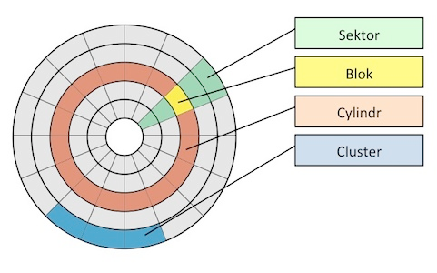
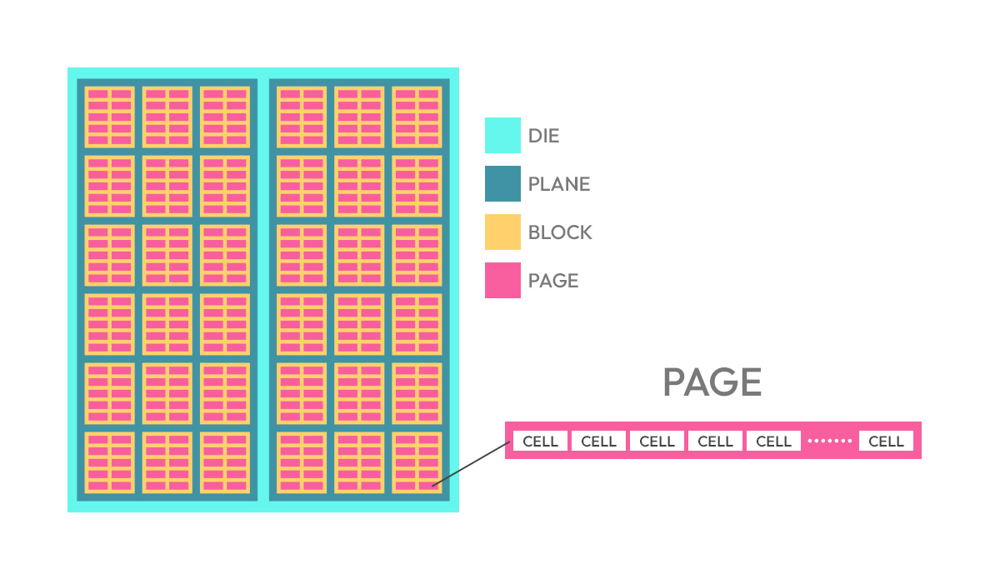

# 10 - Souborové zdroje v síti, správa dat pomocí NTFS teorie/praxe (prej ta otázka má bejt na souborové systémy)

## Souborový systém

Souborový systém je způsob, jakým jsou data organizována a ukládána na disku. Disky dělíme na oddíly (partition),
každý oddíl pak může mít svůj vlastní libovolný souborový systém.

> ### Nejprve pár pojmů pro ujasnění názvosloví:
> 
> 
> HDD je je rozdělený na fyzické **sektory** a otáčí se na něm mechanická zapisovací hlava, dokola po **cylindrech**.
> **Sektory** jsou oblasti, u kterých lze jasně určit aktuální pozici magnetické hlavy na plotně.
> **Blok** je nejmenší fyzická jednotka, do které jde zapsat data / číst z ní data. 
> 
>Pojem **Cluster** už je ale čistě logická jednotka zřízená file systémem. Definuje nejmenší alokovatelnou
> jednotku pro soubor v daném souborovém systému a obvykle se skládá z několika bloků.
> 
> A teď to pojďme ještě víc zamotat: přidáme SSD. 
> 
> V případě SSD najednou mizí cylindry a sektory, **bloky** se navíc dělí na **stránky** a ty jsou obvykle nejmenší zapsatelnou jednotkou.
> Na logické úrovni však stále jako nejmenší jednotku označujeme **blok** a disk dělíme do logických **clusterů**, ty stále
> označují nejmenší adresovatelnou velikost paměti ve file systému. Jenže... někdo logickým blokům u SSD říká **sektor**... x_x
> 
> Je v tom prostě bordel a zcela upřímně... raději bych se tomuhle u maturity vyhnul, nebo vždy vše zmiňoval s konkrétnějším popisem.

Účelem souborového systému je nad libovolnou fyzickou vrstvou zařídit vrstvu logickou. Kromě hierarchického uložení souborů
také jde o zaznamenání metadat o těchto souborech, jako jsou časové známky apod.
Plnohodnotný souborový systém by také měl být schopný spravovat informace o vlastnících souborů a přístupových právech, to je
důležité ve víceuživatelských systémech.

Mezi nejznámější souborové systémy patří:
- **FAT32** - starší souborový systém, který je stále používán pro kompatibilitu s různými zařízeními.
- **EXFAT** - rozšíření FAT32, které podporuje větší soubory a disky.
- **NTFS** - novější souborový systém od Microsoftu, který nabízí větší bezpečnost a funkce.
- **EXT4** - souborový systém používaný v Linuxu.
- **APFS** - souborový systém používaný v MacOS.

Souborový systém si obvykle zřizuje a obsluhuje operační systém a je organizovaný do stromové struktury,
kdy každý soubor musí být v souborovém systému.

V souborovém systému obvykle nalezneme několik typů objektů:
- **Soubor** - základní, může obsahovat texty, obrázky, programy, atd.  
Jakmile je pojmenován, stává se nezávislým na operačním systému, přenositelný v rámci souborového systému.
Jeho vlastnostmi (atributy) jsou:
  - Název
  - Typ
  - Cesta
  - Velikost
  - Metadata (datum vytvoření a úpravy, vlastník, oprávnění)
- **Adresář** - slouží k organizaci souborů do stromové struktury. Jediný rozdíl oproti souboru je 1 atribut.  

Dále...
- **Symbolický odkaz** - "zástupce" - pokud ho smažeme, originální soubor zůstane jak je.
- **Pevný odkaz** - alternativní název pro soubor nebo adresář, pokud ho smažeme, odstraníme celý soubor tak jak je.

> **Odstranění souboru** v rámci souborového systému neznamená jeho smazání z disku, pouze vymazání reference na něj.

### Typická omezení souborových systémů
- **Maximální velikost disku** - určuje největší možnou velikost disku.
- **Maximální velikost souboru** - určuje největší možnou velikost jednoho souboru.
- **Maximální délka názvu souboru** - určuje největší možnou délku názvu souboru.
- **Maximální délka cesty** - určuje největší možnou délku cesty k souboru.
- **Podporované znakové sady** - určuje, jaké znaky mohou být použity v názvech souborů.

### Žurnálování v systémech souborů

Zápis dat a metadat probíhá v několika krocích, proto data nejsou v každém okamžiku konzistentní.
Pokud by v takovou chvíli byl například počítač vypnut, mohlo by dojít k poškození souborového systému.

Proto se využívá žurnálování, tedy uchování chronologického záznamu všech změn. Díky tomu je možné obnovit konzistentní stav
souborového systému i například po takovém neočekávaném vypnutí počítače.

### Diskové kvóty
Diskové kvóty umožňují správci systému omezit množství místa, které může uživatel nebo skupina uživatelů na disku použít.
Kvóty mohou být nastaveny na uživatele, skupiny nebo oddíly a mohou být použity k zabránění uživatelům v plýtvání diskovým prostorem
nebo k zabránění jednomu uživateli v zabrání celého disku.

### Souborová oprávnění
Pro každý objekt v rámci souborového systému můžeme definovat atributy, které omezují přístup k danému objektu.
Typicky se jedná o:
- **Čtení** - umožňuje uživateli číst obsah souboru nebo adresáře.
- **Zápis** - umožňuje uživateli zapisovat do souboru nebo adresáře.
- **Spouštění** - umožňuje uživateli spouštět spustitelné soubory nebo procházet adresáře.
- **Vylistování obsahu adresáře** - umožňuje uživateli zobrazit obsah adresáře.
- **Další zvláštní oprávnění** - například vlastnictví souboru nebo adresáře, změna oprávnění, atd.

**Vlastnická práva** - určují, kdo může soubor číst, zapisovat nebo spouštět.
**Skupinová práva** - určují, kdo může soubor číst, zapisovat nebo spouštět, pokud je uživatel členem určité skupiny.
**Ostatní práva** - určují, kdo může soubor číst, zapisovat nebo spouštět, pokud není vlastníkem nebo členem skupiny.

## NTFS

Jedná se o proprietární souborový systém od Microsoftu, který byl poprvé představen v roce 1993 s Windows NT.

NTFS nabízí několik výhod oproti starším souborovým systémům:
- **Rozšířená bezpečnost** - NTFS podporuje rozšířené oprávnění a šifrování souborů.
- **Integrita dat** - NTFS obsahuje mechanismy pro detekci a opravu chyb na disku.
- **Podpora velkých souborů** - NTFS umožňuje ukládat soubory o velikosti až 16 TB.
- **Podpora velkých disků** - NTFS podporuje velké disky (až 16 EB) a umožňuje efektivnější správu dat. Navíc zvládá i tzv. "dynamic disk"
(dynamické disky), které umožňují vytvářet sofistikovanější diskové pole, jako jsou RAID nebo LVM.
- **Metadata** - NTFS ukládá metadata o souborech a adresářích, což umožňuje rychlejší vyhledávání a správu dat.
- **Podpora dlouhých názvů souborů** - NTFS umožňuje používat dlouhé názvy souborů (až 255 znaků) a cest k nim (až 65535 znaků).

Díky žurnálování lze kontrolovt přístup k souborovým datům. Má také například mechanismy pro zamezení náhodného odstranění. 

Má však také nevýhody, například... je od Microsoftu... :D ... no každopádně vyžaduje poměrně velký overhead, 
zabírá více místa na disku než mnohé jiné souborové systémy. Má také velmi špatnou performance na malých oddílech (cca pod 400 MB).
A není podporovaný v rámci ekosystému Applu.

## Sdílení souborů

Umožňuje přistupovat k souborům z jiného počítače - například z **Windows** lze sdílet:
- **Sdílení souborů** - umožňuje sdílet soubory a složky s ostatními uživateli v síti.
- **Sdílení tiskárny** - umožňuje sdílet tiskárnu s ostatními uživateli v síti.
- **Sdílení internetového připojení** - umožňuje sdílet internetové připojení s ostatními uživateli v síti.
- **Sdílení zařízení** - umožňuje sdílet jiná zařízení, jako jsou skenery nebo webové kamery, s ostatními uživateli v síti.

Oprávnění sdílení se udělí pro skupinu everyone, přístup k jednotlivým souborům se pak omezí na úrovni NTFS.

## Síťové souborové systémy

Jedná se o systémy, které jsou dostupné prostřednictvím počítačové sítě. Mezi nejznámější patří:

**NFS** - Network File System - je síťový souborový systém vyvinutý společností Sun Microsystems, který umožňuje sdílet soubory a složky mezi počítači v síti.

**SMB (CIFS)** - Server Message Block (Common Internet File System) - je síťový souborový systém vyvinutý společností Microsoft, který umožňuje sdílet soubory a tiskárny mezi počítači v síti.

**AFP** - Apple Filing Protocol - je síťový souborový systém vyvinutý společností Apple, který umožňuje sdílet soubory a složky mezi počítači v síti.

Samozřejmě se pro ně nastavují kvóty, oprávnění a další parametry, které jsou důležité pro správu souborů v síti.

## Sdílení dat mezy procesy (IPC Mechanisms)

Podívejme se ještě na sdílení dat na nižší úrovni. V rámci operačního systému máme procesy, které mezi sebou samozřejmě nemohou sdílet
paměť. My však občas potřebujeme, aby mezi sebou komunikovat mohly.
Dalo by se to řešit sdílenou pamětí, avšak máme i jiné způsoby komunikace mezi procesy:

- **Pipes** jsou jednosměrné kanály, které umožňují komunikaci mezi lokálními procesy.
Pro sdílení dat mezi sebou využívají paměť kernelu. Při založení pipy systém vytvoří dva souborové deskriptory, které ukazují na začátek a konec bufferu
této pipe. Jeden proces může skrze pipu zasílat data a druhý proces je číst. Jakmile nejsou potřeba, file descriptory se zase odstraní.  Pipy jsou pouze jednosměrné!

- **Socket** je oproti pipe o trochu složitější, zároveň však mnohem univerzálnější - umožňuje totiž komunikaci mezi vzdálenými procesy.
Namísto souborových deskriptorů (jako u pipe) zakládá systém socketový deskriptor, který je zřízený nad síťovým protokolem.
Síťový stack zajistí abstrakci potřebnou pro komunikaci a je možné tak vytvořit trvalé spojení mezi 2 procesy, které
k sobě mají přístup libovolně přes síť. O řízení tohoto spojení a data v něm se však opět stará kernel operačního systému. Komunikace
může v tomto případě být obousměrná.

> Příklad pipe v Linuxu:
> `ls | grep "file"` - zde je vytvořena pipe mezi výstupem příkazu `ls` a vstupem příkazu `grep`.

> Příklad socketu v Linuxu:
> `nc -l 1234` - zde je vytvořen socket, který naslouchá na portu 1234. K tomuto socketu se můžeme připojit pomocí `nc localhost 1234`.

## Další pojmy

**Doména vs Workgroup** - **Domény** se používají pro velké sítě, bývají centrálně spravovány (např. Active Directory). **Workgroup** je naopak vhodná pro menší
množství počítačů, především pro sdílení osobních dat, bývá zpravidla méně bezpečná. Zatímco doména je centrálně řízená, workgroup je decentralizovaná (peer-to-peer).

----

Klidně můžeme mluvit i o serializaci, formátech jako JSON... O systémech záloh, RAIDu.

Virtuální file systém (VFS) - uživatelský mód vs kernel mód.

