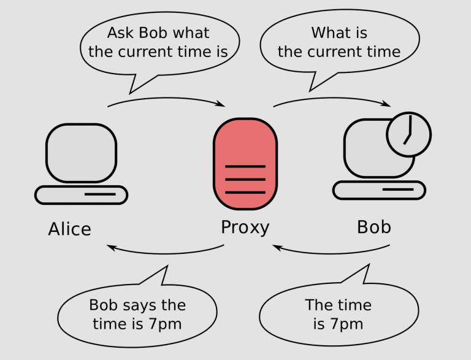

# 11 - Zabezpečení v sítích LAN, bezpečnostní model, zpracování autorizace, bezpečnost VPN

## Pojmy:
- **DDOS**
    - Kybernetický útok, cílem je odepřít nebo znepřítupnit nějakou službu
    - Útok je prováděň přes síť infikovaných počítačů
- **Malware**
    - Škodlivé programy
- **Social engineering**
    - Využívání psychologické manipulace za špatným účelem - i.e. získání pěnez
- **Man-in-the-middle**
    - Útočník odposlouchává komunikaci mezi účastníky
- **Phishing**
    - Podvodná technika k získání citlivých údajů
    - Třeba podvodné emaily, které se tváří jako pravé
- **Bruteforce**
    - Hrubá síla
    - Útočník se snaží rozluštit zašifrovaná data, u kterých nezná klíč
- **NAT**
    - Netwrok address translation
    - Překládá adresy z vnitřního adresního rozsahu do veřejného a naopak
    - Vnitří adresy se tak nikdy nedostanou na internet
    - Za jednu adresu lze skrýt celou vnitřní síť, nehlědě na rozsah
- **VPN**
    - Virtual Private Network
    - Šifrovaný soukromý tunel na server přes který se připojíš na venkovní síť
- **triáda C-I-A (confidentiality, integrity, availability)**
    - Dostupnost = kdy, kdo má přístup, odolnost vůči výpadkům
    - Integrita = data jsou neporušená, nezměněná (CRC, MD5 apod.)
    - Důvěrnost = data jsou dostupná pouze těm, kteří mají mít přístup (byla data nezměněna, nezneužita, komu přišla, kdo je odeslal)
- **AAA**
    - Autentizace - ověření identity
    - Autorizace - oprávnění
    - Accounting - co dotyčný dělá, jak se chová ..

## Bezpečnostní model sítě
- Prevence
    - SW či HW výbava pro zajištění ochrany před možnými hrozbami útoku
- Detekce
    - odhalení neoprávněných činností či slabých míst v síti
- Náprava
    - odstranění zjištěných slabých míst, zamezení práv k možnostem neoprávněných činností

# Zabezpečení podle ISO/OSI modelu 
- **L1**: Physical Layer
```
    • Zabezpečení portů
        ◦ Fyzické porty
        ◦ Vypnutí portů
    • Zamknutí serverové místností
    • Prokazování fyzického přístupu k serverům a žurnálování těchto aktivit
```
- **L2**: Data Link Layer
```
    • Zabezpečení portů
        ◦ Filtrování MAC adres
        ◦ Nastavení módu: Trunk X Access
        ◦ Port security
    • Zabezpečení přístupu
        ◦ Použití hesel
        ◦ Šifrované protokoly (SSH (RSA))
    • VLAN
```
- **L3**:  Network Layer
```
    • Firewall 
        ◦ ACL
            ▪ pravidla na adresu
            ▪ protokoly
            ▪ přeportování
    • ARP útoky
        ◦ ARP spoofing
    • NAT
```

## Zabezpečovací prvky

### Firewall
- Provádí analýzu paketů, sleduje vstupní a výstupní provoz
- Povolení a zákaz aplikací či služeb

### IPS - Intrusion Prevention System
- Identifikuje potenciální hrozby sledováním síťového provozu v reálném čase pomocí analýzy chování sítě
- *Pokud neoprávněný útočník získá přístup k síti, IPS identifikuje podezřelou aktivitu, zaznamená IP adresu a spustí automatickou reakci na hrozbu na základě pravidel předem nastavených správcem sítě.*

### IDS - Intrusion Detection System
-  Aplikace, která monitoruje síťový provoz a vyhledává známé hrozby a podezřelé nebo škodlivé aktivity
- *Většina řešení IDS pouze monitoruje a hlásí podezřelé aktivity a provoz, když zjistí anomálii. Některá z nich však mohou jít ještě dál a při zjištění anomální aktivity přijmout opatření, například zablokovat škodlivý nebo podezřelý provoz.*

### VLAN
- Slouží k logickému rozdělení sítě nezávisle na fyzickém uspořádání
- Jednotlivé VLANy jsou oddělené a pokud je mezi nimi potřebná komunikace, musí procházet routerem

### Proxy 
- Brána mezi námi a internetem
- Tato přidaná vrstva se používá kvůli:
    - Ochraně zapezpečení
    - Anonymitě



### IPSec (IP secure)
- Skupina protokolů pro zabezpečení připojení mezi zařízeními
- Často se využívá k vytváření VPN sítí
- Šifruje IP pakety a ověřuje zdroje, odkud pakety přicházejí
- Skládá se z protokolů:
   - AH - autentizace
   - ESP - šifrování
   - SA - řada protokolů používaných pro vyjednávání šifrovacích klíčů a algoritmů

### AES (Advanced Encryption Standard)
- Narozdíl od starší technologie DES, nehrozí útok hrubou silou
- Délka klíče 128, 192 a 256 bitů
- Symetrický algoritmus - využívá sdíleného klíče k šifrování a dešifrování dat

## VPN
### Druhy VPN
- Site to site
    - Vytváří spojení mezi dvěma nebo více různými sítěmi, například mezi hlavní sítí společnosti a sítěmi jejích satelitních kanceláří
- Remote Access VPN
    - Umožňují uživatelům bezpečné připojení k aplikacím a informacím v hlavním datovém centru společnosti a jejich používání, přičemž všechna přenášená a přijímaná data jsou šifrována
- SSL VPN
    - Umožňuje uživatelům bezpečné připojení k privátním sítím
    - Využívá bezpečnostní protokol SSL nebo jeho nástupce, bezpečnostní protokol TLS (Transport Layer Security), který zajišťuje šifrovaný přenos dat mezi zařízením uživatele a bránou VPN. Toto šifrování chrání integritu a důvěrnost dat a zajišťuje, že je hacker nezachytí nebo změní

## VPN vs proxy
- VPN šifruje, zatímco proxy servery nikoli

- VPN přesměrovává veškerý provoz přes server VPN, protože pracují na úrovni operačního systému, zatímco většina proxy serverů přesměrovává pouze provoz určité aplikace nebo prohlížeče, protože pracují na úrovni aplikace

## Zabezpečení Wi-Fi sítě

### SSID
- Název Wi-Fi sítě
- Možnost skrytí SSID

### MAC
- Možnost nastavení přístupu do sítě pouze vyhrazeným MAC adresám

### Šifrování
- Ochrana před odposloucháváním => data se **nedají zachytit a zneužít**
- Typy zabezpečení:
  - **WEP (Wired Equivalent Privacy)**
    - Zastaralý (prolomen v roce 2001)
    - Šifrování RC4
  - **WPA (Wi-Fi Protected Access)**
    - Nástupce WEP
    - Od roku 2002 (prolomen)
    - Šifrování RC4
  - **WPA2**
    - Nástupce WPA
    - Šifrování AES (poskytuje utajení, integritu a autentizaci - protokol CCMP)
    - Prolomeno
  - **WPA3**
    - Představen počátkem roku 2018
    - Šifruje každé připojení samostatně
    - Možné přes něj na dálku konfigurovat zařízení


## Útoky

### ARP attack
#### Co je ARP?
- Účelem protokolu ARP je překlad mezi adresami na vrstvě datového spoje - MAC adresy - a adresami na síťové vrstvě - IP
- Umožňuje síťovým zařízením "zeptat se", kterému zařízení je aktuálně přiřazena daná IP adresa

#### ARP spoofing
- Útočník odesílá (podvržené) zprávy protokolu ARP do LAN. Cílem je přiřadit útočníkovu MAC k IP jiného hostitele, například default gatewey, což způsobí, že veškerý provoz určený pro tuto adresu IP je místo toho odeslán útočníkovi

- ARP spoofing může útočníkovi umožnit zachytit data frames v síti, upravit provoz nebo zastavit veškerý provoz
- Útok je využíván jako vstupní brána pro další útoky:
    - DDOS
    - man in middle 
    - session hijacking

#### Prevence
- Statický ARP table
- Switch security
- Fyzická securitka


### STP attack
#### Co je STP?
- Protokol linkové vrstvy zabraňující smyčkám v síti
- Vyhledává a blokuje redundatní spoje (které by mohly potenciálně tvořit smyčky v síti)

#### Root bridge útok
- Převzetí kontroly nad root bridgem manipulací síťového pvozu a prohlásí jej za nový root bidge => síť se bez varování vypne

#### Zaplavení BPDU
- Zaplavení sítě zprávami BPDU => vyčerpání siťových zdrojů => přetížení sítě

#### Prevence
- Zabezpečení portů
- Oddělení VLAN
- BPDU guard

### DHCP attack
#### Co je DHCP?
- Rozdává IP adresy - automaticky

#### DHCP starvation attack
- Vyústění k DoS nebo Man in the middle
- Útočník odesílá velké množství falešných **DHCP discover** zpráv s podvrženými zdrojovými MAC adresami => DHCP server se snaží odpovědět => vyčerpá fond IP adres používaných DHCP serverem => legitimní uživatel nemůže získat IP adresu

#### Rogue DHCP neboli DHCP spoofing
- Vyžaduje podvodný DHCP server => vydává klientůnm falešné parametry
- Nejdříve se vypne legitimní DHCP server, který je nahrazen tím falešným


#### Prevence
- Port security
    - Limitování naučených MAC adres => switch forwarduje pouze packety, u kterých zná MAC adresu
- Limit rate
    - Limitování DHCP packetů procházející skrze port za sekundu

### Address spoofing
- Skrývá původní IP adresu útočníka
- Terče útoku si nejsou vědomy, že byly napadeny, takže neodesílají upozornění
- Protože podvržené IP adresy vypadají, že pocházejí z důvěryhodných zdrojů, jsou schopny obejít firewally a další bezpečnostní kontroly, které by je jinak mohly zařadit na černou listinu jako škodlivý zdroj

### DNS spoofing
- Úprava serveru DNS za účelem přesměrování názvu domény na jinou IP adresu

## Ostatní
> Př: zabezpečení switche

- service password encryption
- enable secret
- vypnout nepoužité porty
- pro připojené porty přiřadit mac adresy a reakci na neautorizované zařízení
- klientské porty nastavit jako pouze access, ošetřit trunky
- vzdálený přístup s ssh (uživatel, doména, klíč. SSH2)
- telnet je v plaintextu


> trunk - k čemu slouží, proč
- umožňuje přetagovat pakety z různých VLAN (enkapsulace navíc skrze dot1q), nativní vlan

