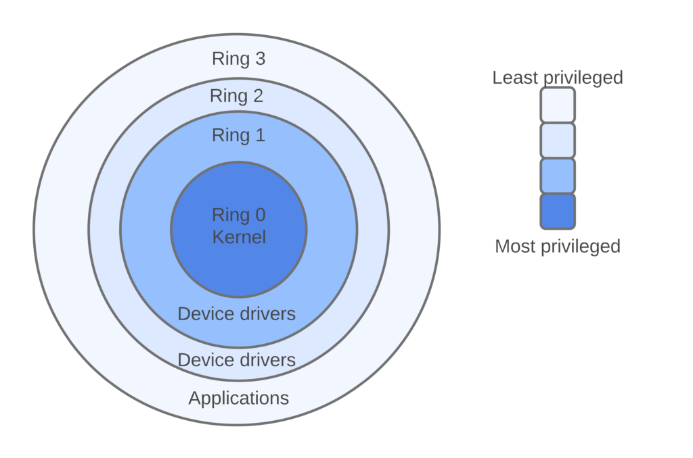
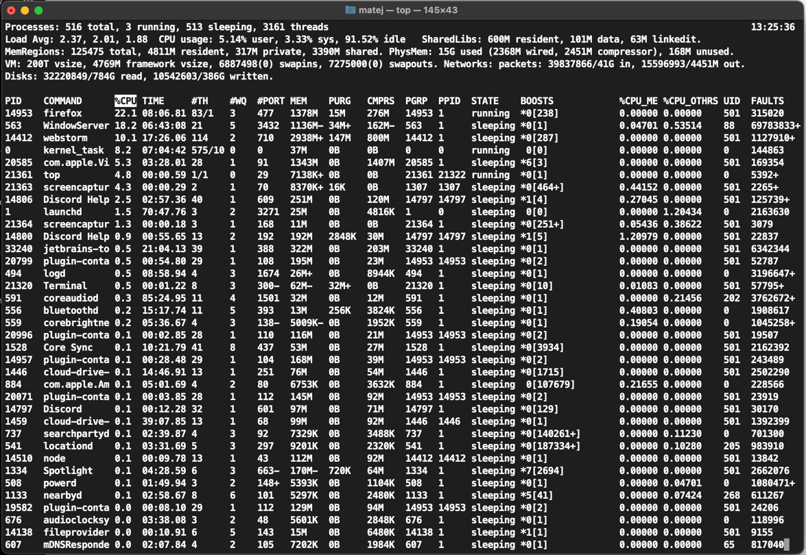

# 13 - Linux

## Pojmy

- **Unix** - Unix je rodina multitaskingových, multiuserových operačních systémů vyvinutých v 70. letech 20. století. Jedná se o sadu operačních systémů, které sdílejí určité základní vlastnosti a principy návrhu. Unixové systémy jsou známé svou modularitou, schopností pracovat v síti, a také podporou příkazového řádku, což umožňuje uživatelům interagovat s systémem prostřednictvím textového rozhraní. Mezi základní principy Unixu patří filozofie "Everything is a file" (Všechno je soubor), což znamená, že zařízení, procesy a síťové komunikace jsou reprezentovány jako soubory.
- **Kernel** - Kernel je jádro operačního systému, centrální část softwaru, která řídí základní operace a poskytuje rozhraní pro interakci mezi hardwarovými součástmi počítače a aplikacemi. Jeho hlavní funkcí je správa zdrojů, jako jsou paměť, procesory, periferní zařízení a síťová komunikace. Kernel přijímá příkazy z uživatelů a aplikací, koordinuje jejich běh a zajišťuje, aby jednotlivé části systému pracovaly harmonicky a efektivně. Je zodpovědný za spouštění a ukončování procesů, alokaci paměti, správu souborového systému a zajištění bezpečnosti a ochrany dat. Jádro je nejzákladnější částí operačního systému a běží v privilegovaném režimu, což mu umožňuje přímý přístup k hardwaru.
- **Terminál** - Terminál je uživatelské rozhraní nebo aplikace, která umožňuje uživatelům interakci s počítačem prostřednictvím textového vstupu a výstupu. V tradičním smyslu může terminál odkazovat na fyzické zařízení, jako je textový terminál připojený k počítači prostřednictvím sériového rozhraní. Nicméně v moderním kontextu se termín terminál často používá k označení softwarové konzole nebo emulátoru terminálu, který poskytuje uživatelům přístup k příkazovému řádku operačního systému. Terminály umožňují uživatelům spouštět příkazy, spravovat soubory, spouštět aplikace a provádět různé úkony prostřednictvím textového rozhraní. Jsou důležitým nástrojem pro pokročilé uživatele a vývojáře kvůli jejich schopnosti efektivně ovládat a řídit systém.
- **Root** - V kontextu operačních systémů a počítačové bezpečnosti se "root" obvykle odkazuje na účet s nejvyššími oprávněními v Unixových a Unix-like systémech. Tento účet je označován jako superuživatel nebo administrátor a má kompletní kontrolu nad systémem. Účet "root" má neomezený přístup k systémovým souborům, může spouštět procesy s maximálními oprávněními a provádět změny, které jsou mimo dosah běžných uživatelů.
- **KDE** - K Desktop Environment je desktopové pracovní prostředí pro Unixové a Unix-like operační systémy, jako je Linux. Jedná se o soubor softwarových aplikací, knihoven a nástrojů, které poskytují grafické uživatelské rozhraní pro interakci s počítačem. KDE nabízí uživatelům prostředí s možností přizpůsobení, souběžně s tím poskytuje intuitivní a uživatelsky přívětivé prostředí. Tento desktopový prostředek zahrnuje okenní manažer, správce souborů, panely, widgety a další aplikace, které usnadňují práci s počítačem a zlepšují uživatelskou produktivitu. KDE je známé svou flexibilitou a možnostmi personalizace prostředí podle potřeb a preferencí jednotlivých uživatelů.
- **GNOME** - GNOME je další populární desktopové pracovní prostředí pro Unixové a Unix-like operační systémy, jako je Linux. Je to sada softwarových aplikací, knihoven a nástrojů, které poskytují uživatelům grafické prostředí pro interakci s počítačem. GNOME se zaměřuje na jednoduchost, eleganci a uživatelskou přívětivost. Jednou z klíčových vlastností GNOME je jeho filozofie "práce založená na aktivitách" (activity-based working), která se zaměřuje na usnadnění práce s otevřenými aplikacemi a dokumenty prostřednictvím dynamických pracovních ploch a uspořádání okolí na základě aktuálních činností.
- **Systémové volání** - Systémové volání je mechanismus, který umožňuje uživatelům a aplikacím komunikovat s jádrem operačního systému a využívat jeho služby a funkce. Když uživatel nebo aplikace potřebuje provést operaci, která vyžaduje přístup k systémovým prostředkům, jako je čtení nebo zápis do souboru, alokace paměti nebo vytvoření nového procesu, použije systémové volání k požádání jádra o provedení této operace. Systémová volání jsou definována operačním systémem a poskytují standardizované rozhraní pro interakci s jádrem. Uživatelé a aplikace mohou volat systémová volání prostřednictvím knihoven nebo API, které poskytují přístup k těmto funkcím.

## Funkce a význam OS

Operační systém (OS) je základní software, který spravuje a koordinuje veškeré operace v počítači. Jeho hlavní funkcí je poskytovat prostředky a rozhraní pro běh aplikací, správu hardwaru, alokaci paměti a řízení vstupů a výstupů.

OS využívá běh v režimu jádra a uživatelském režimu pro zajištění bezpečnosti a stability systému. Jádro operačního systému běží v privilegovaném režimu (jádrovém režimu), což mu umožňuje přímý přístup k hardwarovým prostředkům. Naopak, běžné aplikace běží v uživatelském režimu, kde mají omezený přístup k hardwaru a musí komunikovat s jádrem systému pomocí definovaných rozhraní.

Mapování k vnitřní struktuře operačního systému pomocí tzv. "ringů" (kruhů) se týká architektury operačního systému, která definuje různé úrovně přístupu (nebo oprávnění) mezi jádrem a uživatelskými aplikacemi. Typicky se používají čtyři kruhy nebo "rings" - od kruhu 0 (jádrový režim) až po kruh 3 (uživatelský režim). Jádro systému běží v kruhu 0, což mu poskytuje plný přístup a kontrolu nad hardwarem, zatímco běžné aplikace běží v kruhu 3, kde mají omezené oprávnění a komunikují s jádrem prostřednictvím definovaných rozhraní jádra. Toto rozdělení zajišťuje izolaci a ochranu systému, což je klíčové pro stabilitu a bezpečnost operačního prostředí.

## Linux vs ostatní operační systémy, jeho výhody
Linux je operační systém založený na otevřeném kódu, což znamená, že jeho zdrojový kód je k dispozici a může být upraven, distribuován a využíván komunitou vývojářů. Porovnání Linuxu s ostatními operačními systémy, jako jsou Windows a macOS, závisí na konkrétních potřebách uživatele. Zde jsou některé hlavní aspekty a výhody Linuxu:

- **Otevřený kód**: Jednou z hlavních výhod Linuxu je jeho otevřenost. Tato otevřenost umožňuje komunitě vývojářů přizpůsobit a vylepšovat systém dle potřeb uživatelů, což vede k širokému výběru distribucí (jednotlivých verzí Linuxu) s různými funkcemi a možnostmi.
- **Bezpečnost a stabilita**: Linux je známý svou stabilitou a bezpečností. Díky své otevřené povaze jsou chyby a zranitelnosti rychle identifikovány a opraveny komunitou vývojářů.
- **Flexibilita a možnost přizpůsobení**: Linux nabízí širokou škálu desktopových a serverových distribucí, které lze přizpůsobit potřebám uživatele. Existuje mnoho uživatelských prostředí (GNOME, KDE, XFCE atd.) a softwarových balíčků pro různé účely.
- **Nízké nároky na hardware**: Mnoho distribucí Linuxu má nízké nároky na hardware, což znamená, že může být úsporně využíván i na starších zařízeních.
- **Serverové aplikace a vývoj**: Linux je široce využíván v serverovém prostředí díky své stabilitě, výkonnosti a možnostem přizpůsobení. Je oblíbený pro webové servery, cloudové infrastruktury a vývoj aplikací.
- **Bezplatnost**: Většina distribucí Linuxu je zdarma ke stažení a použití, což je pro mnoho uživatelů atraktivní.

## Distribuce Linuxu
Linuxové distribuce jsou různé verze operačního systému Linux, které kombinují jádro Linuxu s různými sadami softwaru, uživatelskými rozhraními a aplikacemi. Každá distribuce má své vlastní cíle a zaměření, což může zahrnovat stabilitu, použitelnost, bezpečnost, specifické funkce nebo podporu pro různý typ hardwaru.

Často používané jsou napčíklad: 
- **Ubuntu** - Ubuntu je jedna z nejpopulárnějších distribucí Linuxu. Je to open source operační systém, který je založen na Debianu. Ubuntu je známé svou jednoduchostí, uživatelskou přívětivostí a širokou podporou hardwaru.
- **Debian** - Debian je jedna z nejstarších a nejvíce respektovaných distribucí Linuxu. Je to open source operační systém, který je známý svou stabilitou, bezpečností a širokou podporou hardwaru.
- **Red Hat Enterprise Linux** - Red Hat Enterprise Linux (RHEL) je komerční distribuce Linuxu, která je založena na open source projektu Fedora. Je to jedna z nejpopulárnějších distribucí Linuxu pro firemní prostředí, s placenou podporou a dlouhodobou životností.
- **Fedora**
- **Linux Mint**
- **openSUSE**
- **Arch Linux**

... a další.

> Live distribuce je verze Linuxové distribuce, kterou lze spustit přímo z bootovatelného média (jako je CD, DVD nebo USB flash disk) bez nutnosti instalace na pevný disk počítače. To znamená, že uživatel může vyzkoušet danou distribuci Linuxu bez jakýchkoliv změn na svém počítači. 

> Při použití live distribuce se operační systém načte do paměti počítače, což umožňuje uživateli prozkoumat prostředí a funkce dané distribuce. Live distribuce obvykle obsahují základní sadu aplikací a nástrojů pro práci s počítačem, jako je webový prohlížeč, kancelářský software, správce souborů atd.

## Příkaz TOP

Lze ho použít k vypsání informací o procesech, které běží na počítači. Výchozí výpis obsahuje informace o využití CPU, paměti a swapu, čas spuštění, uživateli, pod kterým proces běží, PID procesu a další. Příkaz top je užitečný pro sledování výkonu systému v reálném čase a pro identifikaci procesů, které spotřebovávají nejvíce prostředků.

> Mnohem lepší alternativou je htop, případně ještě lépe bpytop.

Co to je proces a daemon [viz. otázka 2](/02%20-%20Základy%20OS/README.md)

vč. informací z [otázky 3](/03%20-%20Konfigurace%20OS/README.md)

