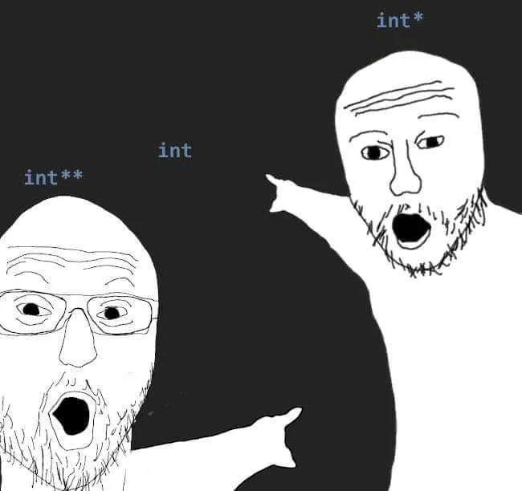

# 22 Data a datové typy

datové typy, reprezentace v paměti, přetypování, silně a slabě typované jazyky, statické a dynamické datové struktury, obecné typy, předávání proměnné hodnotou/odkazem

## Základní/Jednoduché datové typy

- **celé číslo (int)** - Reprezentuje celé číselné hodnoty v počítačové paměti. V závislosti na programovacím jazyku může být rozsah těchto hodnot omezen (např. 32-bitové integer v C).

- **desetinné číslo (float)** - Používá se pro reprezentaci desetinných čísel. Floating point čísla používají exponent a mantisu k reprezentaci čísel s plovoucí desetinnou čárkou.

- **znak (char)** - Ukládá jeden znak v kódování Unicode, ASCII nebo jiném znakovém kódování.

- **dvojnásobné desetinné číslo (double)** - Podobné floatu, ale s větší přesností, často používané pro aplikace vyžadující vyšší přesnost v desetinných číslech.

- **boolean (bool)** - Logická hodnota, která může být buď true (pravda) nebo false (nepravda).

- **datum (date)** - Reprezentuje kalendářní datum a čas v různých formátech, včetně roků, měsíců, dnů, hodin, minut a sekund.

## Složité datové typy

### Čísla

#### Signed X Unsinged

Unsigned mají plnou hodnotu, ale nemohou jít do mínusu, signed mají hodnotu poloviční, ale mohou do mínusu, protože používají první bit jako indikátor znaménka. Každé číslo může být singed nebo unsigned

- Aktivně se používá **BINÁRNÍ KOMPLEMENT**, kde se bity invertují a přičte se 1 - je to proto, aby když se sečte - a + tak vyšla 0.

#### Byte

8 bitů ... 0 až 255

00000000 - používá se celý byte

##### Signed byte

7 bitů ... -127 až 127

0|0000000 - první bit se používá pro znaménko - 0 +, 1 -

#### int apod.

V C# se int skládá ze 4 bytů, v jiných jazycích se to může lišit, ale všechno to funguje stejně jako signed a unsigned byte

#### float, double apod.

Floating point číslo (desetinné)

Skládá se ze tří částí sign, exponent a mantissa

$$
4,206923 * 10^4 = 42069,23
$$

Mantissa je v našem případě 4,206923

Exponent je 4

Sign je 0

Pro float se většinou používá 64 bitů, 1 bit pro sign, 11 pro exponent a zbytek pro mantissu

Floating point čísla jsou nepřesná

Třeba `float == float` bude prakticky vždycky `false`, protože je téměř nemožné dostat z početních operací identický float, když chceme porovnat jestli se 2 floaty rovnají musíme je porovnávat v rozmezí od sebe a ne zda mají identickou hodnotu, některé jazyky to dělají implicitně

Typickým příkladem pro nepřesnost floatů je `0.1 + 0.2` správně by mělo vyjít `0.3`, ale vyjde `0.30000000000000004`

- **Problémy s floating point aritmetikou**: Nelze úplně přesně reprezentovat desetinné hodnoty kvůli konečné přesnosti reprezentace v binární podobě.

## Složené datové typy:

- **pole (array/list)** - Skupina prvků stejného datového typu uložených za sebou v paměti.

- **řetězec (string)** - Sekvence znaků uložená v paměti, často používaná pro reprezentaci textu.

- **objekt** - Složený datový typ, který může obsahovat různé proměnné a metody.

- **struktura (struct)** - Datová struktura, která umožňuje kombinovat různé typy dat pod jedním jménem.

- **slovník (dictionary)** - List který má 2 datové hodnoty Key(většinou int) a Value

## Stack a heap

### Stack

Lokální proměnné a funkční volání jsou spravovány na stacku. Stack je obvykle rychlejší než heap, ale má omezenou velikost.
Ukládá jednoduché typy a pointery na Heap



Pointer ukazuje kde se nachází proměnná v paměti, v C se označuje \*

Celý Stack pracuje na principu LIFO, můžeme do něj rychle zapisovat a rychle číst

Proměnné ve stacku se při předání kopírují

### Heap

Dynamicky alokované proměnné jsou spravovány v heapu. Heap má pomalejší přístup než stack, ale umožňuje dynamické přidělování a uvolňování paměti a nemá omezenou velikost.

Do heapu se ukládají objekty, pole a podobně, zkrátka všechno co je definováno klíčovým slovem new

Pomalý zápis, pomalé čtení

Proměnné v heapu se při předání vytvoří pouze pointer

Zjednodušeně řečeno, v Heapu je bordel, Stack je organizovaný

## Garbage collection

- Mechanismus, který automaticky detekuje a uvolňuje nepoužívanou paměť, čímž pomáhá zabránit únikům paměti a paměťovým chybám.

### Jazyky které používají garbage collection:

- **Java**: Java používá garbage collection k automatické správě paměti, což zjednodušuje vývoj softwaru a snižuje riziko úniku paměti.

- **C#**: Stejně jako Java, i C# má vestavěný garbage collector.

- **Python**: Python používá garbage collection pro automatické uvolňování paměti a eliminaci objektů, které již nejsou používány.

### Jazyky které nepoužívají garbage collection:

- **C**: C je jazyk, který nepoužívá vestavěný garbage collector. To může být náročné a vyžaduje pečlivé sledování alokace a dealokace paměti.

- **C++**: Stejně jako C, i C++ nepoužívá vestavěný garbage collector.

- **Rust**: Rust je jazyk s důrazem na bezpečnost a výkon a nepoužívá garbage collection. Místo toho používá systém vlastnictví a půjčování, který umožňuje bezpečné a efektivní správu paměti za běhu programu.

## Přetypování

Konverze datových typů, která umožňuje převod jednoho typu dat na druhý.
Většina jazyků povoluje implicitní přetypování. To je povoleno pouze v případě, že nedojde ke ztrátě dat, například int -> double, pokud jsme ochotni podstoupit možnou ztrátu dat musíme přetypovat explicitně, v C# pomocí `(typ)`, to je potřeba například při double --> int.

<!--* Tohle mi přijde jako volovina sem dát tbh -->
<!-- ### List možných přetypování

- String to int
- Int to string
- Enum to string
- Enum to int -->

## Silně vs. slabě typované jazyky

- **Silně typované jazyky** - Striktně definují typy a provádějí kontrolu typů při kompilaci.

  - Java
  - C#
  - C++

- **Slabě typované jazyky** - Neprovádějí striktní kontrolu typů a umožňují flexibilní manipulaci s daty.
  - JavaScript
  - Python
  - Ruby

## Dynamické x Statické jazyky

Dynamické jazyky kontrolují typy proměnných při runtimu, Statické jazyky při kompilaci. Typicky statické jazyky jsou Java nebo C#, dynamické Javascript

### Kompilované/interpretované jazyky

- **Kompilované jazyky** - Jsou přeloženy do strojového kódu před spuštěním.

  - C
  - C++
  - Rust

- **Interpretované jazyky** - Jsou interpretovány řádek po řádku za běhu programu.
  - Python
  - JavaScript
  - Ruby

## Generické datové typy

- Umožňují přijímat různé datové typy a provádět operace s nimi bez ohledu na konkrétní typ, což zvyšuje flexibilitu a znovupoužitelnost kódu. Například List<T> v jazyce C# umožňuje ukládat a manipulovat s kolekcí prvků různých typů.
- Pokud je to potřeba můžeme blíže specifikovat T pomocí where

```csharp
public class Trida<T> where T: IComparable
{
    ...
}
Zdroj: https://www.itnetwork.cz/csharp/kolekce-a-linq/c-sharp-tutorial-uvod-do-kolekci-a-genericita
```
