# 23 - Řízení toku programu
## Podmíněné výrazy
Podmíněné výrazy jsou základním prvkem pro ovládání toku programu v mnoha programovacích jazycích.
Pomocí nich můžeme definovat různé větve kódu, které budou provedeny v závislosti na splnění určité podmínky.

```C#
if (statement) {
    // Do something cool
} else if (another_statement == 1) {
    return true;
} else return false
```

Lze zkrátit od jednohu řádku pomocí ternárních operátorů:
```cs
bool vysledek = (podminka) ? true : false;
```
Lze mít více ternárních operátorů v jednom řádku
```cs
bool vysledek = (podminka) ? true : (podminka2) ? true : false;
```

## Cykly
Cykly slouží k opakování částí kódu, dokud je splněná určitá podmínka.
Existují různé typy cyklů, jako je for, foreach, while a do-while.
```C#
//Declare some iterable variable
//Provide a statement that has to be fulfilled. It's checked at beginning of each iteration.
//Give it an action that will be executed on the end of each iteration.
//This one iterates while i < 5 (5 iterations) and writes out the index of each one.
for (int i = 0; i < 5; i++) {
    Console.WriteLine($"Iteration {i}");
}

//Shorter version of for, without statement,
//just going through all elements in iterable such as 
//array, list, dictionary etc.
foreach (int number in array) {
    Console.WriteLine($"Current number: {number}");
}

//This loop just checks whether the statement is true or not 
//and based on that continues exectuing its code or "closes" itself
while(!statement) {
    if(i<5)
        statement=true
    i++;
}

//Exactly the same, except the statement is being 
//checked on the end of iterations
do {
    if(i<5)
        statement=true
    i++;
} while(!statement)
```
### Do-while vs while
**While loop:**
- Ve while loopu je podmínka zkontrolována před provedením bloku kódu
- To znamená, že pokud je podmínka na začátku nepravdivá, blok kódu vůbec nevykoná a cyklus se vůbec neprovede

**Do-while loop:**
- V do-while loopu je podmínka zkontrolována po provedení bloku kódu
- To znamená, že blok kódu se vždy provede a poté se kontroluje podmínka. Pokud je podmínka pravdivá, cyklus se opakuje; pokud ne, cyklus končí

### Kdy jaký loop použít?
- for loop:
    - Přesně víme, kolik opakování chceme
- while loop:
    - Neznáme přesný počet opakování předem, tudíž checeme opakovat dokud je/není splněná určitá podmínka
- do-while loop:
    - Smyčku chceme provést alespoň jednou a poté dokud je/není splněná určitá podmínka
- foreach:
    - Vhodný pro situace, kdy potřebujeme projít všechny prvky kolekce (například pole, seznam nebo jiný typ kolekce) a provést s nimi nějakou operaci.

## Switch
```csharp
 switch (day)
        {
            case 1:
                Console.WriteLine("Monday");
                break;
            case 2:
                Console.WriteLine("Tuesday");
                break;
            case 3:
                Console.WriteLine("Wednesday");
                break;
            case 4:
                Console.WriteLine("Thursday");
                break;
            case 5:
                Console.WriteLine("Friday");
                break;
            case 6:
                Console.WriteLine("Saturday");
                break;
            case 7:
                Console.WriteLine("Sunday");
                break;
            default:
                Console.WriteLine("Invalid day");
                break;
        }
```

### Propadávání:

```csharp
    switch (number)
    {
        case 1:
            Console.WriteLine("One");
            // Propadnutí na následující case
        case 2:
            Console.WriteLine("Two");
            // Propadnutí na následující case
        case 3:
            Console.WriteLine("Three");
            break;
        default:
            Console.WriteLine("Other");
            break;
    }
```
## Výjimky
Vyjímky jsou zvláštní typy událostí, které mohou nastat během běhu programu a které mohou narušit běžný tok kódu. Použití **správného řízení výjimek může zlepšit stabilitu a bezpečnost vašeho programu**. V C# se vyjímky řídí pomocí bloků try, catch a finally. Základní struktura vypadá takto:

```csharp
try
{
    // Kód, který může vyvolat výjimku
    // Např. Out of bounds of array nebo špatný parse
}
catch (TypVýjimky1 ex)
{
    // Obsluha konkrétního typu výjimky TypVýjimky1
    Throw new OutOfBoundsException();
}
catch (TypVýjimky2 ex)
{
    // Obsluha konkrétního typu výjimky TypVýjimky2
    Throw new 
}
finally // Kdo kurva používa finally????
{
    // Volitelný blok finally, který se vždy provede bez ohledu na to, zda byla výjimka vyvolána nebo ne
}
```

### Try
**Obsahuje kód, ve kterém může nastat výjimka**. Pokud se v tomto bloku objeví výjimka, program se okamžitě přesune na odpovídající blok catch.
### Catch
Obsahuje kód pro **zpracování výjimky**. Můžete mít více bloků catch pro různé typy výjimek. Pokud se vyskytne výjimka odpovídající danému typu v catch, program provede kód uvnitř tohoto bloku.
### Finally
**Je volitelný** a obsahuje kód, který se vždy provede, bez ohledu na to, zda byla výjimka vyvolána nebo ne. Často se používá k uvolnění prostředků nebo k provedení kódu, který by měl být spuštěn vždy, když se blok try dokončí.

--- 
```
SystemException – jsou built-in výjimky
ApplicationException – jsou user-defined výjimky
```

### Chyba (error) vs výjimka (exception) 
- Chyby představují stavy, jako je chyba kompilace, syntaktická chyba, chyba v logické části kódu, nekompatibilita knihovny, nekonečná rekurze atd
- Chyby jsou obvykle mimo naši kontrolu a neměli bychom se je pokoušet řešit
- Výjimky můžeme zachytit a ošetřit<br>
<br>

## Řízení událostmi (events and delegates)

### Co je událost (event)?
- Událost (event) je oznámení odeslané objektem, které signalizuje výskyt nějaké akce. Události v prostředí .NET se řídí observer design patternem.
- Třída, která události vyvolává, se nazývá Publisher (vydavatel) a třída, která oznámení přijímá, se nazývá Subscriber (účastník). Odběratelů jedné události může být více. Typicky vydavatel vyvolává událost, když došlo k nějaké akci. Odběratelé, kteří mají zájem dostávat oznámení, když k nějaké akci došlo, by se měli zaregistrovat k události a zpracovat ji.
- V jazyce C# je událost (event) zapouzdřený delegát => je závislá na delegátovi. Delegát definuje signaturu pro metodu obsluhy události třídy subscribe

### Co je delegate?
- Použijeme pokud chceme předat funkci jako parametr
- Delegát je datový typ referenčního typu, který definuje signaturu metody. Stejně jako u jiných datových typů můžete definovat proměnné delegáta, které mohou odkazovat na libovolnou metodu se stejnou signaturou jako delegát
- Při práci s delegáty se postupuje ve třech krocích:
    - Deklarovat delegáta
    - Vytvoření instance a odkaz na metodu
    - Vyvolání delegáta
- Delegáta lze deklarovat pomocí klíčového slova delegate, za kterým následuje signatura funkce

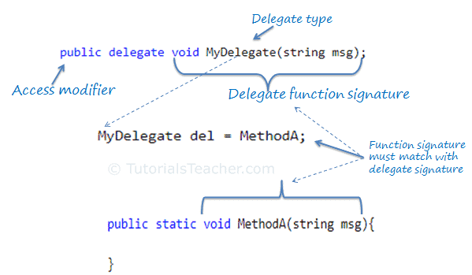

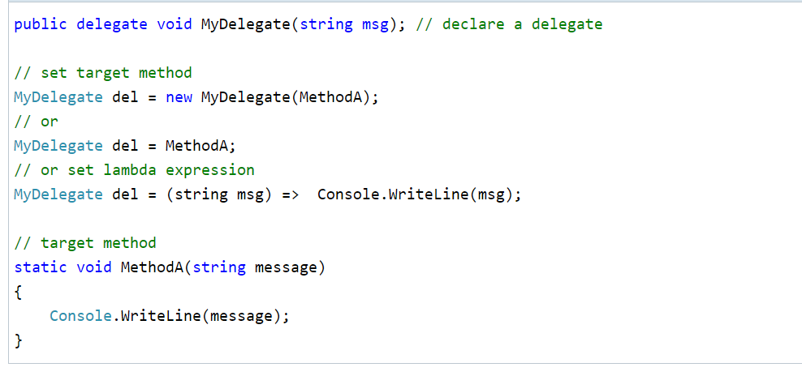

### Func
- Built-in delegat, ktery vraci hodnotu/hodnoty

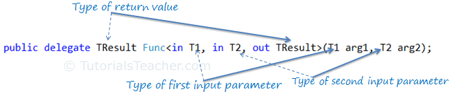

### Action

- Built-in delegat, ktery ale nic nevraci
- Vyuziva se tedy s void metodami

```cs
Action action = () => Console.WriteLine("Hello World!");
```

### Observer pattern
Observer je návrhový vzor chování, který umožňuje definovat mechanismus odběru pro upozornění více objektů na všechny události, které se stanou s objektem, který pozorují.

**Problém:**
*Předstame si, že máme dva typy objektů: Zákazník a Obchod. Zákazník má velký zájem o výrobek určité znacky, který by měl být brzy dostupný v obchodě.
Zákazník by mohl obchod navštěvovat každý den a kontrolovat dostupnost produktu. Dokud je však výrobek stále na cestě, většina těchto cest by byla zbytečná.*
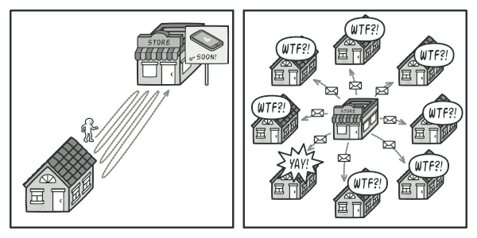

*Na druhou stranu by obchod mohl posílat všem zákazníkům spoustu e-mailů (což by mohlo být považováno za spam) pokaždé, když je k dispozici nový produkt. To by některým zákazníkům ušetřilo nekonečné cesty do obchodu. Zároveň by to ale naštvalo jiné zákazníky, kteří o nové produkty nemají zájem.*

**Řešení:**

Vzor Observer navrhuje přidat do třídy publisher mechanismus odběru, aby se jednotlivé objekty mohly přihlásit k odběru nebo odhlásit z proudu událostí přicházejících od tohoto publisheru. Tento mechanismus se skládá z 1) pole pro uložení seznamu odkazů na objekty odběratelů a 2) několika veřejných metod, které umožňují přidávat odběratele do tohoto seznamu a odebírat je z něj.

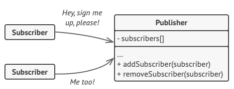
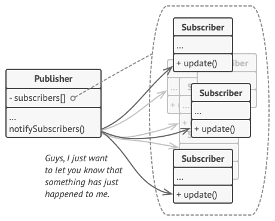

## Funkcionální programování

### Co je to funkcionální programování?

Existují tři "typy" programování:
- procedurální programování
- objektově orientované programování
- funkcionální programování

V objektově orientovaném programování (OOP) vytváříme "objekty" (odtud název), což jsou struktury, které mají data a metody. Ve funkcionálním programování je vše funkcí. Funkcionální programování se snaží oddělit data a chování a OOP tyto pojmy spojuje.

### Proč?
- Lehčí debugování
- Lepší / rychlejší pochopení kodu /můžeme diskutovat/

### Jaká jsou pravidla funkcionálního programování?
Pro pochopení tohoto konceptu je třeba znát dvě hlavní věci:
- Data jsou neměnná: Pokud chceme změnit data, například pole, vrátíme nové pole se změnami, nikoli původní.
- Funkce jsou bezstavové: Funkce se chovají, jako by to bylo poprvé, pokaždé! Jinými slovy, funkce dává vždy stejnou návratovou hodnotu pro stejné argumenty

- Funkce by měly přijímat alespoň jeden argument
- Funkce by měly vracet data nebo jinou funkci
- Nepouzivaji se loopy

Vic tady: https://github.com/readme/guides/functional-programming-basics 

### Neměnitelné typy 
- Upřednostňujeme vracení nových instancí, pokud změníme stávajicí typ

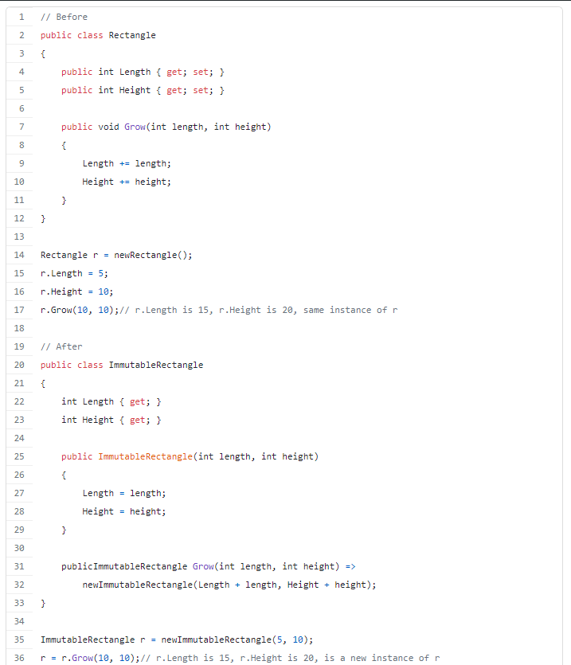

### Vyjádření místo výroků (Expression Instead of Statements)
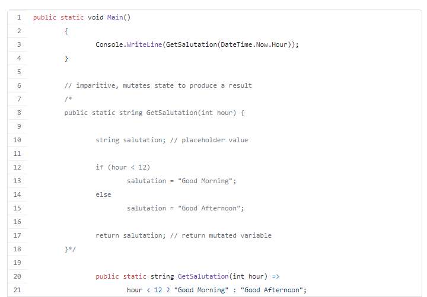

### Method Chaining/Pipe-lining and Extension Methods
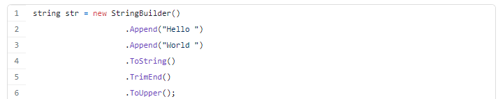

### LINQ
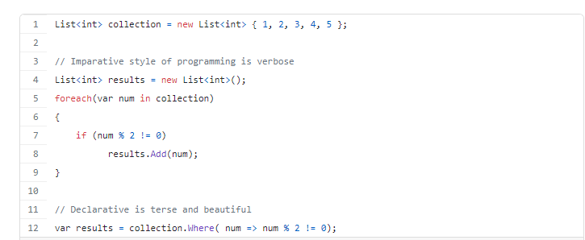
*Muzeme videt, ze pouziti LINQ (WHERE klauzule) vypada lepe a splnuje podminky funkcionalniho programovani*

### Higher-Order Functions (HOF)
- Funkce vyššího řádu jsou funkce, které přijímají funkci jako argument nebo vracejí funkci (nebo obojí).
- Jejich opakem jsou funkce prvního řádu - to znamená, že nepřijímají funkci jako argument ani nevracejí funkci.
- HOF se vyskytuji v lambdach

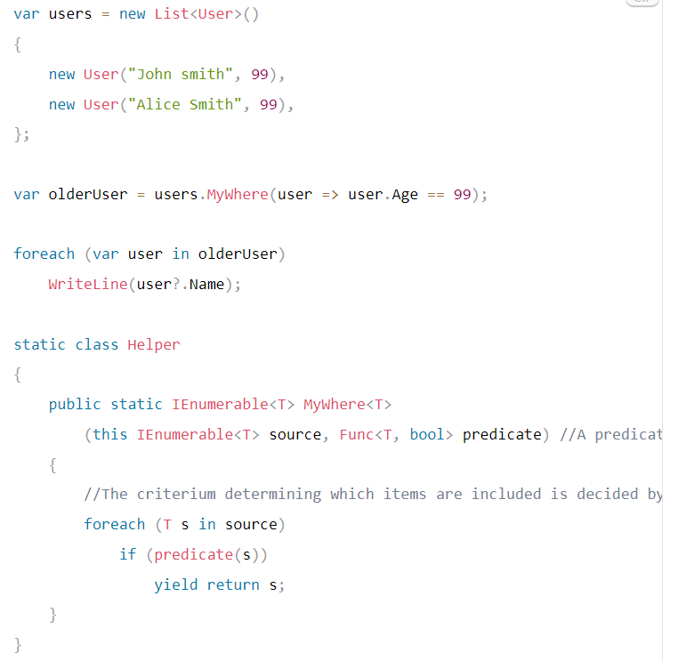
*Creation of higher-order function (MyWhere)*
<br>

---

Seznam věcí, které by měla tato otázka obsahovat

-- větvení
úplné (má else)
neúplné (lze "obcházet" části kódu)

-- switch
PHP, JS vs C# - propadávání (společné casy)

-- ternární operátor


-- cykly
for, foreach (pracuje s kolekcemi - vyžaduje iterátory)
while, do-while (kdy se kontroluje podmínka)
break, continue


-- výjimky
try, catch, finally (vykoná se vždy, i po výjimce, a to i přes return! - pro zavření souboru apod.)
pouze v objektových jazycích - výjimka = objekt, který nese informaci o chybě


řízení událostmi (event-driven programming) (WPF, JavaScript DOM)
Manager, eventloop - zpracovává události... loop - čeká na události, když přijde, zpracuje je
event - něco se stalo, např. kliknutí na tlačítko


funkcionální programování (FP)
- funkce jako první třída
- funkce vázané na sebe ( ()->()->()->() )


