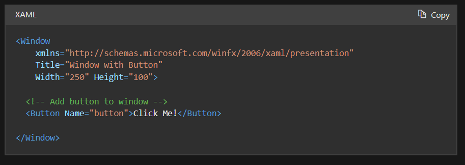
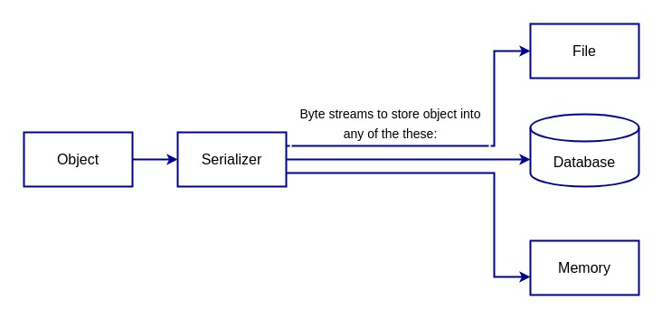
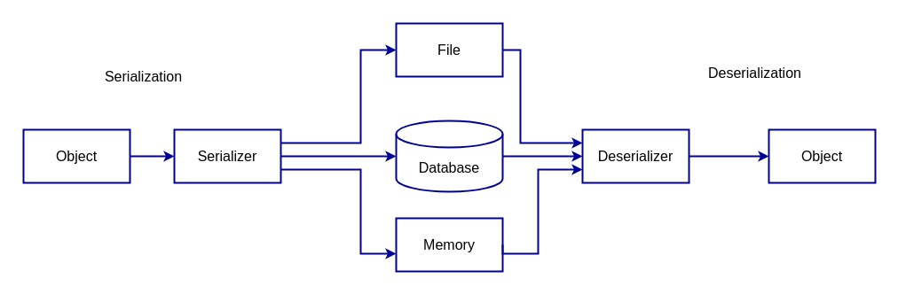
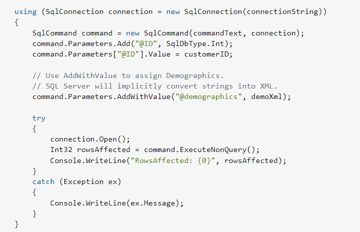

syntaxe xaml (syntaxe dle xml)

události (eventy) - přetížení += s delegátem

tok procedurální vs tok podle událostí vs tok řízený daty

binární vs textový soubor (UTF dnes až 4 byty)

načítání a zápis do souboru (uzamčení souboru při zápisu)
serializace a deserializace (xml, json, binární formát)

připojení k databázi (raw SQL, ORM)

struktura xml a json 

---
 

*(návrh, XAML/WinForms, binární/textové a XML soubory, serializace dat, přípojení C# k databázi)* 

 

# Návrh
1. Zjistit:
    - Účel aplikace (co budu dělat)
    - Pro koho to budu dělat
    - Proč to vlastně dělám
2. Techstack
3. Design aplikace
4. Testování
5. Dokumentace
6. Distribuce
7. Údržba

# XAML/WinForms 
## Winforms
• Základní platformu pro vývoj "klasických" aplikací pro Windows se standardním vzhledem a použitím standardních ovládacích prvků
• UI framework
• Poskytuje vývojářům nástroje pro vytváření windows desktopových aplikací 
## WPF (Windows Presentation Foundation)
    • Současná platforma pro vývoj desktopových aplikací systému Windows
    • Moderní, pokročilý, hardwarově akcelerovaný framework pro vývoj aplikací
    • Odděluje UI od logiky aplikace
    • Podpora pokročilejšího vykreslování 2D vektorové a 3D grafiky 
    • Obrovská škála možností pro vytváření bohatých, interaktivních a kvalitních uživatelských rozhraní
## Oddělování UI a logiky
    • K implementaci vzhledu aplikace se obvykle používá XAML, zatímco k implementaci chování aplikace se využívá csharp. 
    • Toto oddělení vzhledu a chování má následující výhody:
        ◦ Snižují se náklady na vývoj a údržbu, protože značení specifické pro vzhled není úzce spojeno s kódem specifickým pro chování.
        ◦ Vývoj je efektivnější, protože návrháři mohou implementovat vzhled aplikace současně s vývojáři, kteří implementují chování aplikace.
## XAML
    • XAML je značkovací jazyk založený na XML, který deklarativně implementuje vzhled aplikace
    • Obvykle se používá k definování oken, dialogových oken, stránek a uživatelských ovládacích prvků a k jejich naplnění ovládacími prvky, tvary a grafikou

*Protože jazyk XAML je založen na XML, uživatelské rozhraní, které s jeho pomocí skládáme, je sestaveno do hierarchie vnořených prvků, která je známá jako strom prvků. Strom prvků poskytuje logický a intuitivní způsob vytváření a správy uživatelského rozhraní.*

# Binární/textové/XML soubory
## Binární
    • Ukládají data ve formátu binárních číslic (bitů), reprezentujících stavy 0 a 1
    • Určeny pro zpracování procesorem počítače, nejsou snadno čitelné člověkem
    • Binární soubory mohou reprezentovat různé informace, včetně textu, obrázků, zvuku a videa
    • Každý bit může nabývat hodnot 0 nebo 1, což umožňuje vyjádření dvou stavů nebo hodnot
    • Konkrétní vzor použitý k uspořádání bloků v binárním souboru je určen formátem souboru. 
    • Existuje mnoho různých formátů souborů => každý má svou specifickou strukturu a účel
        ◦ Např. spustitelné soubory používají specifický vzor pro ukládání instrukcí, které může procesor počítače přímo vykonávat, zatímco obrazové soubory používají jiný vzor pro ukládání dat jako mřížku pixelů
    • Po vytvoření mohou být uloženy na pevném disku počítače nebo přenášeny po síti
    • Příkladem: QR code je bitmap obrázek

### Proces vytváření binárního souboru:
    • Začíná vytvořením datového toku, posloupnosti binárních číslic
    • Datový tok je uspořádán do bloků, každý obsahující určitý počet bitů
    • Toto pořadí určuje procesor počítače, který čte datový tok a průběžně interpretuje hodnoty bitů
    • Bloky jsou uspořádány do vzoru, například mřížky nebo stromu, vytvářející binární soubor

## Textové
    • Obsahuje řetězce znaků ve formě textu
    • Každý znak je reprezentován kódem, např. ASCII nebo Unicode
        ◦ Unicode je větší než ASCII
    • Slouží pro ukládání lidsky čitelných informací, jako jsou textové dokumenty, konfigurační soubory, nebo zdrojové kódy.

## XML
    • Značkovací jazyk (markup language) používaný k zakódování dokumentů, které mohou číst lidé i stroje. 
    • K popisu struktury a vlastností dokumentu používá vlastní značky
    • Jazyk XML se od jazyka HTML liší tím, že umožňuje uživatelům vytvářet vlastní značkovací symboly, díky čemuž je rozšiřitelný a samostatně definovatelný
    • Soubory XML se používají jako základ pro různé formáty dokumentů, včetně RSS, konfiguračních souborů Microsoft .NET a souborů Microsoft Office
    • Soubory XML lze otevírat a upravovat pomocí textových editorů, webových prohlížečů, online editorů a programů určených pro konkrétní aplikace
    • XML je nezávislý na platformě a programovacím jazyku
    • Používá se pro výměnu dat mezi různými systémy

## JSON
    • Standardizovaný formát pro reprezentaci strukturovaných dat
    • Vznikl z programovacího jazyka JavaScript, ale je využíván v širokém spektru aplikací
    • Často používán pro přenos dat mezi systémy a jako formát pro požadavky a odpovědi v API
    • Data jsou v párech jméno/hodnota
    • Data jsou oddělena čárkami
    • Kudrnaté závorky {} obsahují objekty
    • Nezávislý na programovacím jazyce
    • Čitelný programátorem

## CSV
    • Prostý textový soubor ukládající data
    • Datové položky jsou odděleny čárkami / středníky
    • Často používán pro kompatibilitu s různými programy
    • Otevíratelné v textových editorech, tabulkových procesorech (např., Excel) nebo specializovaných aplikacích
    • Umožňují snadný přenos dat mezi různými aplikacemi
    • Každý řádek představuje jeden záznam nebo položku 
 

# Serializace dat
- Objekt má tři základní charakteristiky: identitu, stav a chování. Stav představuje hodnotu nebo data objektu.
- Serializace je proces převodu stavu objektu na proud bajtů. Tento proud bajtů lze poté uložit do souboru, odeslat po síti nebo uložit do databáze. Proud bajtů představuje stav objektu, který lze později rekonstruovat a vytvořit novou kopii objektu.
- Serializace nám umožňuje uložit data spojená s objektem a znovu vytvořit objekt na novém místě.

*Důležitý je výběr formátu, do kterého se bude serializovat.*

## Serializační formáty
Pro serializaci lze použít mnoho různých formátů, například JSON, XML a binární formát. JSON a XML jsou oblíbené formáty pro serializaci, protože jsou čitelné pro člověka a lze je snadno analyzovat jinými systémy. Binární formáty se často používají z výkonnostních důvodů, protože jejich čtení a zápis je obvykle rychlejší než u textových formátů.

## Deserializace
Deserializace je opačný proces než serializace. Zahrnuje převzetí proudu bajtů a jeho převedení zpět na objekt. Provádí se pomocí příslušných nástrojů pro analýzu proudu bajtů a vytvoření nového objektu.

## Skladování a přenos
Serializace a deserializace jsou v programování důležité, protože umožňují snadné ukládání a přenos objektů mezi různými systémy. To je užitečné zejména v distribuovaných systémech (RMI), kde se objekty musí přenášet mezi různými počítači, nebo ve webových aplikacích, kde se objekty musí přenášet mezi webovým serverem a webovým prohlížečem.
Webová aplikace například umožňuje uživatelům vytvářet a ukládat dokumenty. Když uživatel uloží dokument, musí aplikace uložit stav dokumentu do databáze.
Za tímto účelem musí aplikace nejprve serializovat objekt dokumentu na proud bajtů a poté tento proud bajtů uložit do databáze. Později, když chce uživatel dokument otevřít, musí aplikace načíst proud bajtů z databáze. Nejprve deserializuje proud bajtů zpět na objekt dokumentu a poté dokument uživateli zobrazí.

### Serializace vs Marshalling
**Serializace:** Při serializaci objektu se do proudu bajtů zapisují pouze členská data tohoto objektu, nikoli kód, který objekt implementuje.

**Marshalling:** Objekt: Termín Marshalling se používá, když hovoříme o předávání objektu vzdáleným objektům (RMI). Při Marshalling je Objekt serializován(členská data jsou serializována) + je připojena kódová základna.

Serializace je tedy součástí Marshallingu.

CodeBase je informace, která příjemci Objektu říká, kde lze najít implementaci tohoto objektu. Každý program, který si myslí, že by někdy mohl předat objekt jinému programu, který ho možná ještě neviděl, musí nastavit codebase, aby příjemce věděl, odkud má kód stáhnout, pokud nemá kód k dispozici lokálně. Příjemce po deserializaci objektu z něj načte kódovou základnu a načte kód z tohoto umístění.  
 
# Připojení C# k databázi
    1. Importnutí System.Data.SqlClient
    2. Vytvoří se connection string (buď string nebo přes SqlConnectionStringBuilder)
        a. Data source: server
        b. Initial Catalog: Database name
        c. User ID: name of user
        d. Password: no.. prostě heslo :) 
    3. Vytvoří se instance SqlConnection => passne se connection string
        a. V případě, že byl použit SqlConnectionStringBuilder, musi se ještě volat property ConnectionString
    4. Zavolá se sqlConnection.Open() -> otevírá spojení
    5. Hotovo
    6. Po skončení by se měl zavolat sqlconnection.Close()

**NEDOPORUČUJE SE DĚLAT, PO ZKOMPILOVÁNÍ KODU SE ČLOVĚK DOSTANE K HESLU**

## Možnost dva:

Pouziti PHP serveru a skrze WebRequrest si stahovat odezvy 

Ochrana před SQL injeciton:
    • Měli bychom ošetřit vstup od uživatele
    • Použitím command.Paramater

