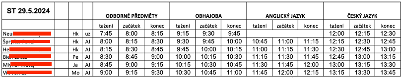

# maturita-resources
Řešené otázky k maturitě - DELTA. 

K jednotlivým otázkám jsem na Quizletu začal připravovat sety flash karet, pro naučení a ověření vědomostí:
https://quizlet.com/Kesimek/folders/maturita-2024-odborna?i=5trjya&x=1xqt

Je možné spustit jak jednotlivé otázky, tak vše najednou z Quizletové složky.

-----
Otázky označené jako `P` jsou pouze pro skupinu programátorů, `G` pro skupinu grafiků.

-----

Dělejte si s tím co chcete, pull requestujte, forkujte, whatever.

----- 
Úspěšnost maturtantů kteří používali tento repozitář:
100% lol.


-----
## Jak probíhá samotná ústní zkouška?

Několik týdnu před maturitou škola zašle rozpis zkoušek:



Samotná zkušební místnost pak vypadala nějak takto (zkouška se konala v učebně 210, ostatní mohli čekat buď na židlích uvnitř, nebo v učebně 319):


```
zelené bloky = židle
žluty blok = židle na zkoušení
tmavě modrý blok = stůl na potítko
světle modrý blok = stůl pro učitele a zkoušení
tmavě zelené bloky na spodu = židle pro posluchače
červené kolečka = táci s číslama
```
Průběh zkoušení:
1. Přijdete přibližně 2 minuty před tažením.
2. Jakmile přijde čas, vylosujete si číslo z tácku.
3. Dostanete papír s pojmy a otázkami k tématu, které jste si vylosovali - následuje 15 minut na přípravu.
    
> **Příklad otázky 15 - Digitální fotografie:**
> - 8f, 1/30, CCD a CMOS, Hloubka ostrosti, ISO
> - Popište vznik první fotografie, co to byla Camera Obscura, Lanterna Magica, Camera Lucida, Diorama, jak se přišlo na aditivní míchání barev.
> - Jaké znáte druhy fotoaparátů (3 kategorie).
> - Popište přípravu kompozice fotografie, nastavení fotoaparátu v různých prostředích.
> - Jaké jsou pravidla při kompozici a nejčastější chyby.
> 
> ... + ještě něco, ale přesně si to teď nevybavuji.
> 
> Důležité je, že zpravidla tyto otázky na papíře jsou dostatečné na to, aby vydaly na 15 minut zkoušení, není potřeba řešit příliš
> mnoho informací nad rozsah těchto otázek, stejně se k nim člověk nedostane.

4. Během přípravy si člověk sepíše na papír svoje myšlenky.
5. Následuje 15 minut ústního zkoušení.

Učitelé byli velmi vstřícní, nedělají "naschvály".
